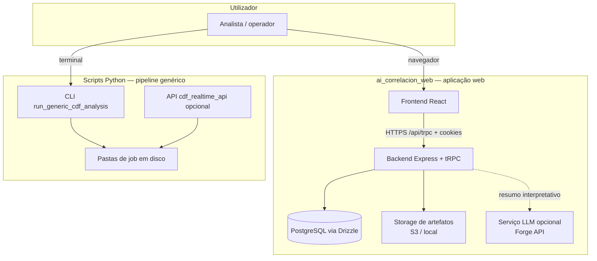
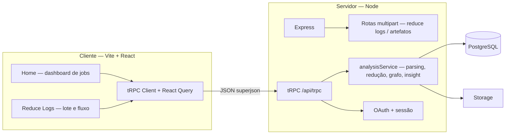
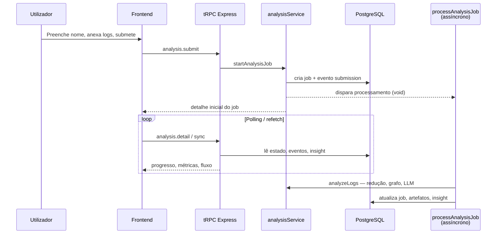

# Manual completo do sistema — projeto AI_correlacion_contradef

Este documento descreve **todo o ecossistema** do repositório **AI_correlacion_contradef**: objetivos, arquitetura, comunicação entre partes, requisitos funcionais e não funcionais, e um glossário para leitores **sem formação técnica**. Para detalhes pontuais da aplicação web, consulte também [`docs/web/AI_CORRELACION_WEB.md`](web/AI_CORRELACION_WEB.md), [`docs/web/GUIA_DE_USO.md`](web/GUIA_DE_USO.md) e [`docs/web/MAPEAMENTO_REDUCAO_HEURISTICA.md`](web/MAPEAMENTO_REDUCAO_HEURISTICA.md).

---

## 1. Para quem é este manual

| Perfil | O que vai encontrar |
| --- | --- |
| **Gestor ou analista** | Seções 2, 3.1, 6, 9 e 10 — o que o sistema faz, em linguagem simples. |
| **Engenheiro / DevOps** | Seções 3–8 — rotas, tRPC, base de dados, jobs, limites e variáveis de ambiente. |
| **Pesquisador** | Ligação entre logs CDF, heurísticas de redução, grafo de fluxo e relatórios. |

---

## 2. O que é o sistema (visão simples)

> **Em uma frase:** o projeto ajuda a **entender comportamento de software suspeito** a partir de **traces e logs** produzidos pela ferramenta **Contradef**, reduzindo ruído, destacando APIs e técnicas de evasão, e apresentando um **caminho interpretável** até uma classificação e um nível de risco.

O repositório tem **dois grandes braços**:

1. **Scripts Python** (`scripts/`) — pipeline **genérico** para pacotes `7z`, correlação por função, API local opcional e geração de relatórios Markdown/DOCX em disco (`data/jobs/`, etc.).
2. **Aplicação web** (`ai_correlacion_web/`) — **Contradef Log Analyzer**: interface para enviar logs, correr **redução heurística e correlação no servidor Node.js**, guardar histórico em base de dados, mostrar dashboards, fluxo em grafo, exportação Excel e texto explicativo (incluindo LLM quando configurado).

Ambos partilham a **mesma ideia de negócio** (correlação e leitura de evidências), mas **não são obrigatoriamente acoplados** em tempo de execução: a web app processa análises no seu próprio backend; o Python continua útil para workflows em linha de comando e integrações legadas.

---

## 3. Arquitetura em camadas

### 3.1. Diagrama lógico (ecossistema do repositório)

### 3.2. Diagrama da aplicação web (detalhe)

**Ficheiros de entrada do servidor** (`server/_core/index.ts`): registo de middleware JSON (limite elevado para metadados), **proxy de storage**, **OAuth**, **download de artefatos**, **upload em chunks (Reduce Logs)**, montagem do **tRPC** em `/api/trpc`, e em desenvolvimento o **Vite** middleware; em produção, ficheiros estáticos do build.

---

## 4. Componentes principais e responsabilidades

### 4.1. Frontend (`ai_correlacion_web/client/`)

| Peça | Função |
| --- | --- |
| **React 19 + Vite** | Interface reativa; build otimizado para produção. |
| **wouter** | Rotas: `/` (Home), `/reduce-logs` (Redução de logs em lote). |
| **TanStack Query + tRPC** | Chamadas tipadas ao backend, cache e revalidação. |
| **Páginas** `Home.tsx`, `ReduceLogs.tsx` | Dashboard de análises; fluxo completo de upload, métricas, tabs (resumo, fluxo, artefatos, eventos). |
| **Componentes analíticos** | `FlowJourneyDiagram`, `FlowCorrelationGraph` (grafo com `@xyflow/react` + `dagre`), painéis MITRE, tabelas, exportação Excel. |
| **`shared/analysis.ts` (import no cliente)** | Contratos Zod/tipos alinhados com o servidor — mesma “linguagem” de dados. |

### 4.2. Backend (`ai_correlacion_web/server/`)

| Peça | Função |
| --- | --- |
| **`analysisRouter.ts`** | Procedimentos tRPC: listar jobs, detalhe, submeter, sincronizar, métricas de baseline. |
| **`routers.ts`** | Agrega `system`, `auth`, `analysis`. |
| **`analysisService.ts`** | Núcleo analítico: normalização de linhas, **redução heurística**, deteção de APIs/técnicas, **gatilhos** heurísticos, classificação de malware, **construção do `flowGraph`**, geração de artefatos, **insight** (Markdown + JSON). |
| **`_core/context.ts`** | Contexto tRPC: utilizador autenticado (ou bypass local em dev). |
| **`_core/reduceLogsUpload.ts`** | Upload multipart e por chunks para ficheiros grandes; integração com `startAnalysisJob`. |
| **`analysisArtifactDownload.ts`** | Download autenticado de artefatos quando não há URL de objeto direta. |
| **`db.ts` + `drizzle/schema.ts`** | Persistência PostgreSQL (jobs, eventos, artefatos, insights, commits). |

### 4.3. Scripts Python (raiz do repositório)

| Peça | Função |
| --- | --- |
| **`scripts/cdf_analysis_core.py`** | Núcleo reutilizável de análise genérica sobre CDFs. |
| **`scripts/run_generic_cdf_analysis.py`** | CLI: arquivo `7z` ou diretório, foco por função/regex, saídas em `data/jobs`. |
| **`scripts/cdf_realtime_api.py`** | API FastAPI opcional para upload e acompanhamento de jobs (fluxo paralelo à web app). |
| **Relatórios** | `generate_generic_report.py`, `generate_generic_docx.py`, `build_mermaid_from_json.py`. |

### 4.4. Dados partilhados

- **`ai_correlacion_web/shared/`** — tipos e schemas Zod consumidos por cliente e servidor (ex.: `analysis.ts`, constantes, MITRE).
- **`docs/`** — documentação humana (este manual, guias web, melhorias por fases).

---

## 5. Comunicação entre componentes

### 5.1. Browser ↔ servidor web

| Canal | Descrição |
| --- | --- |
| **tRPC sobre HTTP** | Pedidos `POST` para `/api/trpc` com batching; serialização **superjson** (datas, `Map`, etc.). |
| **Cookies de sessão** | Autenticação alinhada com o SDK OAuth da plataforma; em desenvolvimento pode existir **utilizador local fictício** se OAuth não estiver configurado. |
| **Corpo JSON grande** | Express aceita JSON até ordem de **50 MB** para metadados/controlo (configuração em `index.ts`). |
| **Upload multipart / chunks** | Rotas dedicadas para Reduce Logs (ficheiros até vários GB, conforme limites no módulo de upload). |
| **Download de artefatos** | URL assinada (storage) ou rota `/api/analysis-artifacts/download?...` com sessão válida. |

### 5.2. Sequência típica — submissão de análise (web)

O método `startAnalysisJob` **cria o job**, regista eventos e devolve o detalhe **sem esperar** o fim do processamento pesado; o trabalho continua em `processAnalysisJob` → `analyzeLogs`.

### 5.3. Servidor ↔ base de dados

- **Drizzle ORM** com schema PostgreSQL: utilizadores, jobs de análise, eventos append-only, artefatos, insights (resumo + JSON estruturado com `flowGraph`), commits opcionais.
- Migrações / push: script `db:push` no `package.json` da web app.

### 5.4. Servidor ↔ storage e LLM

- **Artefatos** (relatório Markdown, JSON de logs reduzidos, `flow-graph.json`) enviados via camada de storage quando configurada; caso contrário podem existir caminhos locais com download via API.
- **LLM** (`_core/llm.ts`, variáveis Forge): gera texto interpretativo; falhas são tratadas ao nível do fluxo de insight sem impedir a análise determinística.

### 5.5. Python ↔ disco (pipeline CLI)

- Comunicação **ficheiro-centric**: manifestos, `status.json`, `events.jsonl`, saídas em pastas de job. Integração com a web app **não é automática** neste manual — são pipelines que podem coexistir para o mesmo tipo de dados (CDF / traces).

---

## 6. Requisitos funcionais

Os requisitos abaixo referem-se sobretudo à **aplicação web**; entre parêntesis indicam-se extensões do **pipeline Python** onde aplicável.

| ID | Requisito | Notas |
| --- | --- | --- |
| RF-01 | **Autenticar utilizadores** e restringir procedimentos analíticos a sessões válidas | tRPC `protectedProcedure`; exceções de desenvolvimento documentadas em código. |
| RF-02 | **Submeter um ou mais ficheiros de log** (tipos Contradef: FunctionInterceptor, traces, etc.) | Validação de tipo por nome/conteúdo; limites de contagem/tamanho. |
| RF-03 | **Reduzir logs** preservando linhas com APIs suspeitas, técnicas, foco literal/regex e **gatilhos** (ex.: padrões de memória RX) | Implementado em `analysisService.ts`. |
| RF-04 | **Calcular métricas** (linhas/bytes antes e depois, percentagem de redução, contagens de eventos/gatilhos) | Exposto no dashboard e em `summaryJson`. |
| RF-05 | **Classificar** amostra (Trojan, Spyware, Ransomware, Backdoor, Unknown) e **nível de risco** | Heurísticas sobre técnicas e conteúdo. |
| RF-06 | **Derivar fase comportamental** corrente a partir da sequência de eventos | Usado no resumo e no grafo. |
| RF-07 | **Construir grafo de fluxo** (`flowGraph`: nós fase/API/veredito, arestas com relações semânticas) | Visualização em colunas e grafo interativo. |
| RF-08 | **Gerar insight** em Markdown (título, resumo, recomendações) e persistir em `analysisInsights` | Opcionalmente enriquecido por LLM. |
| RF-09 | **Listar e filtrar jobs**, ver detalhe, timeline de eventos, artefatos com download | Home + detalhe. |
| RF-10 | **Redução de logs em lote** (`/reduce-logs`): upload simples ou chunked, monitorização por ficheiro, exportação Excel | `ReduceLogs.tsx`, `reduceLogsUpload.ts`. |
| RF-11 | **Exportar dados** (Excel do fluxo, relatório Markdown como artefato, JSON do grafo) | Cliente + artefatos no job. |
| RF-12 *(Python)* | Processar arquivo `7z` ou diretório, correlacionar por `--focus` / `--focus-regex`, emitir relatórios e Mermaid | Scripts na raiz do repositório. |

---

## 7. Requisitos não funcionais

| ID | Categoria | Descrição |
| --- | --- | --- |
| RNF-01 | **Segurança** | Endpoints analíticos protegidos; cookies com opções de produção; downloads de artefatos validados por sessão; segredos via variáveis de ambiente (`JWT_SECRET`, URLs OAuth, chaves Forge). |
| RNF-02 | **Disponibilidade** | Jobs assíncronos: submissão não bloqueia até ao fim do processamento; UI pode consultar estado incrementalmente. |
| RNF-03 | **Escalabilidade / limites** | Limite global de eventos normalizados por job (`MAX_EVENTS` no serviço analítico); limites de ficheiros por submissão; uploads grandes via chunks. Ajustar conforme hardware e política de retenção. |
| RNF-04 | **Performance** | Redução e parsing em Node; complexidade depende do tamanho dos logs. Recomenda-se monitorizar tempo por ficheiro e tamanho de resposta do detalhe do job. |
| RNF-05 | **Manutenibilidade** | Tipos partilhados (`shared/`), testes Vitest em rotas e métricas; documentação em `docs/web/`. |
| RNF-06 | **Auditabilidade** | Tabela `analysisEvents` com histórico; artefatos imutáveis por versão de job. |
| RNF-07 | **Portabilidade** | App Node + PostgreSQL; Python 3.11+ para scripts; variáveis de ambiente documentadas no código (`_core/env.ts`) e `.env` local. |
| RNF-08 | **Usabilidade** | Tema escuro, componentes acessíveis (Radix), textos em português na UI analítica. |

---

## 8. Configuração e operação (resumo técnico)

### 8.1. Variáveis de ambiente relevantes (web app)

Definidas ou lidas tipicamente via `.env` (ver `server/_core/env.ts`):

- **`DATABASE_URL`** — ligação PostgreSQL para Drizzle (`postgresql://...`).
- **`JWT_SECRET`** — segredo de cookies/sessão em produção.
- **`OAUTH_SERVER_URL`**, **`VITE_APP_ID`** — integração OAuth.
- **`BUILT_IN_FORGE_API_URL`**, **`BUILT_IN_FORGE_API_KEY`** — opcional, para LLM.
- **`NODE_ENV`**, **`PORT`** — modo e porta HTTP (com fallback se porta ocupada).

### 8.2. Comandos úteis (`ai_correlacion_web/`)

| Comando | Efeito |
| --- | --- |
| `npm run dev` | Servidor de desenvolvimento com Vite integrado. |
| `npm run build` | Build cliente Vite + bundle do servidor. |
| `npm run start` | Entrada produção (`dist/index.js`). |
| `npm run check` | Verificação TypeScript (`tsc --noEmit`). |
| `npm run test` | Testes Vitest. |
| `npm run db:push` | Sincronizar schema Drizzle com a base de dados. |

### 8.3. Deploy

- Gerar build de produção, definir variáveis de ambiente no alvo, garantir PostgreSQL acessível e storage (S3 ou compatível) se usado.
- Rever limites de corpo HTTP e timeouts para uploads muito grandes.
- O caminho temporário de upload no módulo Reduce Logs pode ser específico do ambiente — validar em `reduceLogsUpload.ts` antes de colocar em produção.

---

## 9. Glossário para leitores não técnicos

| Termo | Explicação simples |
| --- | --- |
| **Log / trace** | Registo do que o programa fez durante a execução (chamadas a funções, memória, etc.). |
| **Contradef** | Ferramenta que produz esses registos; o sistema lê esses ficheiros para ajudar na análise. |
| **Redução** | Apanhar só as partes “importantes” do log para o analista não ter de ler milhões de linhas iguais. |
| **Heurística** | Regra prática automática (não é um humano a decidir linha a linha); pode ter falsos positivos/negativos. |
| **Gatilho** | Trecho do log que o sistema marca como **especialmente crítico** (ex.: indícios fortes de preparação de memória executável ou injeção). Nem todo o comportamento suspeito é “gatilho”. |
| **Evidência** | Comportamento suspeito ligado a uma fase no diagrama; é mais largo do que “gatilho”. |
| **Fluxo / fase** | Etapas típicas da vida do malware (inicialização, evasão, desempacotamento, etc.) usadas para **organizar a narrativa**. |
| **Grafo** | Mapa de caixas e setas: mostra **o que liga a quê** (fases, APIs, veredito). |
| **Job** | Um “trabalho” de análise: enviou ficheiros, o sistema processou e guardou resultado. |
| **Artefato** | Ficheiro gerado (relatório, JSON reduzido, grafo exportado) associado ao job. |
| **tRPC** | Forma moderna de o website pedir dados ao servidor com **contratos tipados** — reduz erros de comunicação. |
| **LLM / IA** | Modelo de linguagem que pode **explicar** o resultado em texto corrido; a deteção de padrões continua a ser feita por regras e código. |

---

## 10. Onde aprofundar

| Documento | Conteúdo |
| --- | --- |
| [`README.md`](../README.md) | Visão do repositório, CLI Python, estrutura de pastas. |
| [`docs/web/AI_CORRELACION_WEB.md`](web/AI_CORRELACION_WEB.md) | Foco na web app. |
| [`docs/web/GUIA_DE_USO.md`](web/GUIA_DE_USO.md) | Uso prático da interface. |
| [`docs/web/MAPEAMENTO_REDUCAO_HEURISTICA.md`](web/MAPEAMENTO_REDUCAO_HEURISTICA.md) | Mapeamento das regras de redução. |
| [`docs/arquitetura_fluxo_comunicacao.md`](arquitetura_fluxo_comunicacao.md) | Diagramas genéricos front/back/Python. |
| [`docs/generic_realtime_workflow.md`](generic_realtime_workflow.md) | Workflow tempo-real genérico. |
| Pasta [`docs/melhorias/`](melhorias/) | Histórico de planos e patches por fase. |

---

## 11. Manutenção deste manual

- **Versão do código:** alinhado com o estado do repositório na data de escrita; após alterações grandes em `analysisService.ts`, rotas ou schema, atualizar as secções 4–6 e 8.
- **Contacto interno:** equipa que mantém `ai_correlacion_web` e os scripts Python deve coordenar para que este ficheiro continue a refletir **dois modos de operação** (web vs CLI) sem os confundir num único deployment obrigatório.

---

*Documento gerado para a pasta `docs/` do projeto AI_correlacion_contradef — manual técnico e funcional unificado.*
