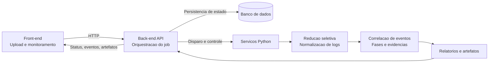
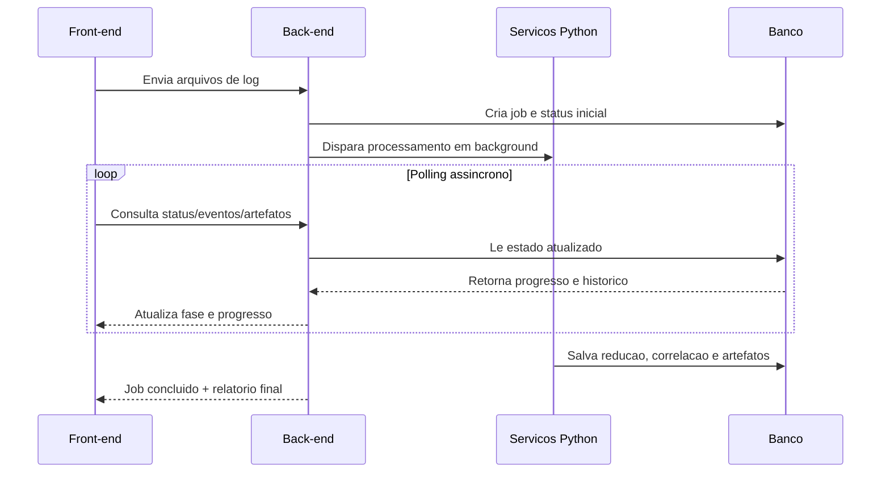

# Arquitetura e Fluxo de Comunicacao do Sistema

Documento visual com foco em clareza executiva e leitura rapida.

## Visao geral

- O front-end recebe os arquivos e acompanha o estado do job.
- O back-end centraliza autenticacao, persistencia e orquestracao.
- Os servicos Python fazem a analise, a correlacao e a geracao de relatorios.
- A etapa de reducao prepara os logs brutos para a leitura analitica.
- O banco preserva o historico operacional e os artefatos do processo.

## Fluxo principal

Figura 1. Fluxo ponta a ponta do sistema.

## Sequencia do job

Figura 2. Sequencia operacional resumida.

## Comunicacao entre componentes

- Front e back conversam por HTTP e consultas assincronas.
- Back e Python trocam arquivos de job e resultados intermediarios.
- Banco e back sincronizam estado, eventos e artefatos.
- A reducao de logs entrega saida normalizada para a correlacao.

## Resumo executivo

A arquitetura transforma entrada bruta em analise interpretavel, com um fluxo continuo de ingestao, reducao, correlacao, persistencia e relatorio.
