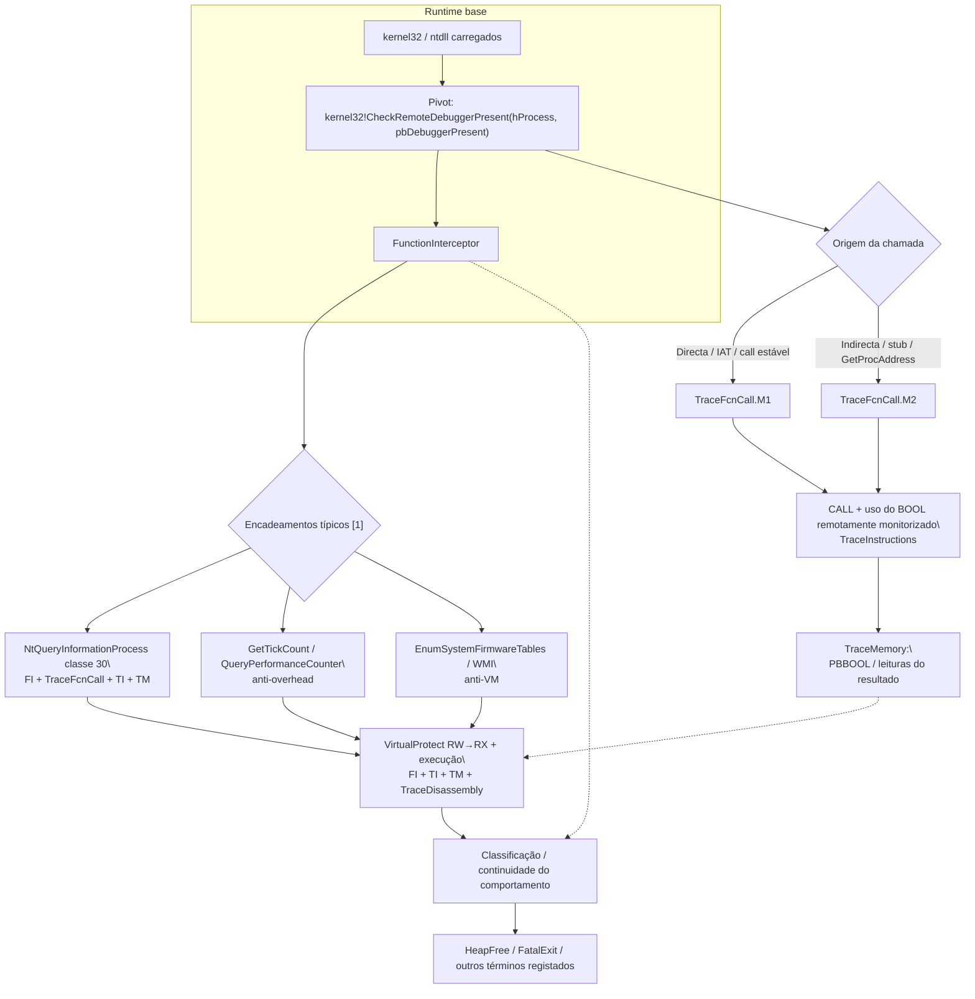

# Fluxo mapeado a partir de `CheckRemoteDebuggerPresent`

## Escopo e premissa analítica

Este documento segue a mesma metodologia que o fluxo **`IsDebuggerPresent`** e o pacote paralelo **`LoadLibraryA`**, estendendo-a à API **`CheckRemoteDebuggerPresent`** (`kernel32.dll`) — deteção de **depurador ligado ao processo alvo** através da interface clássica de duas entradas **`(hProcess, pbDebuggerPresent)`**, em que típica ou frequentemente o processo observado é o **corrente** (pseudo-handle / `GetCurrentProcess`-equivalente) e o resultado escreve‑se num **`BOOL`**.

No material de referência do relatório-resumo, **`CheckRemoteDebuggerPresent`** surge explicitamente **a seguir** ao `IsDebuggerPresent` na cadeia anti‑debug, usando a mesma estrutura de correlação nos artefatos Contradef: **`FunctionInterceptor`**, **`TraceFcnCall.M1` / `TraceFcnCall.M2`**, **`TraceInstructions`**, **`TraceMemory`** e **`TraceDisassembly`** [1].

## Papel de cada artefato na correlação

| Artefato Contradef | Papel relativamente a `CheckRemoteDebuggerPresent` | O que procurar |
|---|---|---|
| **`FunctionInterceptor.cdf`** | Evento de entrada/saída em `kernel32!CheckRemoteDebuggerPresent` | Ordem temporal, thread, argumentos quando o trace os expuser (`hProcess`, ponteiro para `BOOL` de saída); encadeamento antes/depois de `IsDebuggerPresent` ou `NtQueryInformationProcess`. |
| **`TraceFcnCall.M1.cdf`** | Chamada **directa** ao *thunk* de importação ou `call` estável | Bloco chamador previsível; menos ofuscação. |
| **`TraceFcnCall.M2.cdf`** | Chamada **indirecta** ou resolução tardia (`GetProcAddress`, *stub* de *packer*) | Prova de tentativa de ocultar anti‑debug atrás de camada indireta. |
| **`TraceInstructions.cdf`** | Instrução do `CALL`; preparação dos argumentos (**base do `hProcess`**, endereço **`pbDebuggerPresent`**); ramos após `test`/`cmp` no **BOOL** referenciado | Liga o evento de API ao fluxo de decisão (continuar vs evadir/abortar). |
| **`TraceMemory.cdf`** | Leituras/escritas no **buffer de saída** `*pbDebuggerPresent`; contexto de estruturas relacionadas se o trace gravar acessos próximos ao teste | Reforça prova de que o resultado da verificação foi **consumido** em memória. |
| **`TraceDisassembly.cdf`** | Bloco básico em que o anti‑debug está embebido; caminho após o resultado (comparável ao ramo pós‑`IsDebuggerPresent`) | Fecha a narrativa “verificou remotamente e depois…” (unpack, *exit*, outra API). |

Assinatura habitual (resumo):  
`BOOL CheckRemoteDebuggerPresent(HANDLE hProcess, PBOOL pbDebuggerPresent);`

## Cadeia lógica de correlação (ordem de trabalho sugerida)

1. **`FunctionInterceptor`**: Confirmar ocorrência **`CheckRemoteDebuggerPresent`**; anotar vizinhança cronológica com **`IsDebuggerPresent`** e **`NtQueryInformationProcess`** (classe 30) quando presente [1].
2. **`TraceFcnCall.M1`** vs **`TraceFcnCall.M2`**: Classificar **origem directa** vs **indirecta** por ocorrência.
3. **`TraceInstructions`**: Ancorar **`CALL`** / retorno; recuperar desvios condicionais ligados ao **`BOOL`** remoto.
4. **`TraceMemory`**: Correlacionar endereço de **`pbDebuggerPresent`** com leitura subsequente no *callsite* ou em *helper*.
5. **`TraceDisassembly`**: Situar a rotina no grafo de comportamento (trojan/VMProtect‑like, *stub* opaco, ou sequência limpa de anti‑debug em cadeia).

Para **`TraceInstructions`** e **`TraceMemory`** muito grandes, trabalhar primeiro com **janela temporal ou endereço** já fixado nos passos anteriores.

## Diagrama de fluxo (estrutura análoga ao de `IsDebuggerPresent`)

1. Runtime base (**`kernel32`** / **`ntdll`**) — **`FunctionInterceptor`**.  
2. Pivot **`CheckRemoteDebuggerPresent(hProcess, pbDebuggerPresent)`** — **`FunctionInterceptor`**.  
3. Ramificações **origem**: **`TraceFcnCall.M1`** (directa) **vs** **`TraceFcnCall.M2`** (indirecta / dinâmica).  
4. **Confluência**: argumentos e resultado no **`BOOL`** — **`TraceInstructions`** + **`TraceMemory`**.  
5. Continuações típicas da cadeia descrita em [1]: **`NtQueryInformationProcess`** (classe **30**, conforme o relatório resumido); **`GetTickCount` / `QueryPerformanceCounter`** (anti‑*overhead*); **`EnumSystemFirmwareTables` / WMI** (anti‑VM); depois **`LocalAlloc`**, **`VirtualProtect`**, execução de código preparado (**`TraceDisassembly` + `TraceInstructions`**).  
6. Saídas: classificação (malware com pipeline anti‑debug em profundidade) ou encerramento quando registado (**`HeapFree` / `FatalExit`**) em continuidade com o relatório‑base [1].

## Fluxo correlacionado (tabela sintética)

| Ordem | Foco analítico | Artefatos | Resultado esperado |
|---:|---|---|---|
| 1 | Marcos `CheckRemoteDebuggerPresent` ordenados no tempo | `FunctionInterceptor` | Confirmação do marco anti‑debug “remoto” |
| 2 | Origem directa da chamada | `TraceFcnCall.M1` | Callee / bloco chamador determinístico |
| 3 | Origem indirecta da chamada | `TraceFcnCall.M2` | *Call* via ponteiro / *GetProcAddress* |
| 4 | Instrução exacta + ramos sobre o resultado `BOOL` | `TraceInstructions` | Decisões de fluxo ligadas ao depurador remoto |
| 5 | Prova de escrita/leitura do `BOOL` out | `TraceMemory` | Correlação de dados com decisão posterior |
| 6 | Bloco lógico e continuações | `TraceDisassembly` | Contexto unpacking / evasão / término |

## Diagrama Mermaid

## Pontos inicial, intermediário e final

| Tipo de marco | Evento típico | Interpretação |
|---|---|---|
| Inicial contextual | Cadeia após **`IsDebuggerPresent`** ou entrada numa sequência anti‑debug | Contexto já “calente” pela primeira checagem [1] |
| Início específico | Chamada bem documentada a **`CheckRemoteDebuggerPresent`** | Início focal deste fluxo exportado como pivô próprio |
| Intermediário decisivo | Correlação M1 vs M2 + resultado **`BOOL` em memória** | Prova de que o comportamento diferencia cenário remotamente depurável |
| Final analítico | Confluência com outras técnica(s) ou *unpack*, ou saída do *stub* | Conclusão replicável em matriz de relatório |

## Limitações

Endereços, *timestamps* e argumentos **byte a byte** dependem dos `*.cdf` reais (`contradef.*`). O modelo acima é **estruturalmente alinhado** ao relatório sintético [1] e aos procedimentos de correlação multi‑arte.

## Referências cruzadas

- Fluxo enquadrado em **`IsDebuggerPresent`**: [`docs/legacy/isdebuggerpresent_flow/fluxo_isdebuggerpresent_mapeado.md`](../../docs/legacy/isdebuggerpresent_flow/fluxo_isdebuggerpresent_mapeado.md).  
- Pacote paralelo **`LoadLibraryA`** (carga por path ASCII): [`../LoadLibraryA/fluxo_loadlibrarya_mapeado.md`](../LoadLibraryA/fluxo_loadlibrarya_mapeado.md).  
- Artefatos e scripts relacionados sob [`../isdebuggerpresent_flow/`](../isdebuggerpresent_flow/).  
- Tipos típicos de ficheiros: `FunctionInterceptor`, `TraceFcnCall.M1`, `TraceFcnCall.M2`, `TraceInstructions`, `TraceMemory`, `TraceDisassembly`.

## Referências

[1] Documento sintético e pacote técnico do repositório que encadeia **`IsDebuggerPresent`** → **`CheckRemoteDebuggerPresent`** → **`NtQueryInformationProcess`** e restante fase; ver [`fluxo_isdebuggerpresent_mapeado.md`](../../docs/legacy/isdebuggerpresent_flow/fluxo_isdebuggerpresent_mapeado.md).
