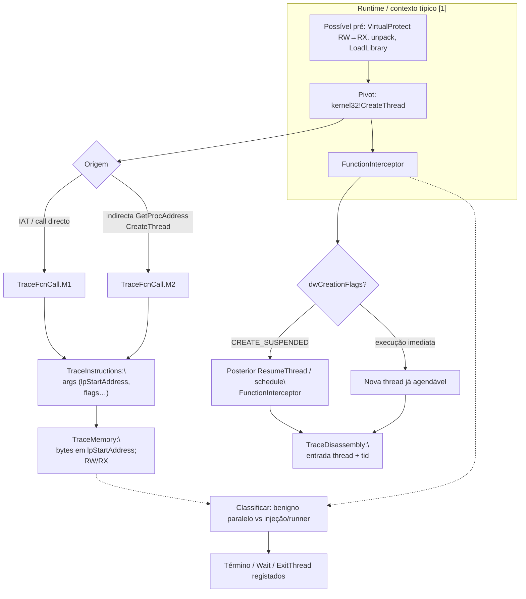

# Fluxo mapeado a partir de `CreateThread`

## Escopo e premissa analítica

Este documento segue a mesma metodologia que os fluxos em **`legacy_artifacts`** (**`LoadLibraryA`**, **`CheckRemoteDebuggerPresent`**, **`ZwQueryInformationProcess`**): correlacionar o pivô **`CreateThread`** entre os artefatos Contradef **`FunctionInterceptor.cdf`**, **`TraceFcnCall.M1` / `.M2.cdf`**, **`TraceInstructions.cdf`**, **`TraceMemory.cdf`** e **`TraceDisassembly.cdf`**.

**`kernel32!CreateThread`** inicia uma *thread* de utilizador cuja entrada é **`lpStartAddress`**, com opcional **`lpParameter`**, **`dwCreationFlags`** (p.ex. **`CREATE_SUSPENDED`**), **`lpThreadId`**. Para análise de malware e *packers*, este marco liga‑se habitualmente:

- despacho para **shellcode**, *stub* já preparado por **`VirtualProtect`**, **`WriteProcessMemory`**, ou unpacking,
- paralelização de tarefas após **`LoadLibraryA`** (**`DLL` injetadas** ou módulos recém-mapeados),
- continuação temporal depois das checagens de anti‑debug descritas no fluxo **`IsDebuggerPresent`** [1].

Correlação forense: **evento de API** → **origem do `call` (M1 vs M2)** → **argumentos e `CREATE_SUSPENDED`** → **propriedades da região de `lpStartAddress` em memória** → **primeira execução no novo *thread ID* (`TraceDisassembly` / `TraceInstructions` por *thread*)**.

## Papel de cada artefato na correlação

| Artefato Contradef | Papel relativamente a `CreateThread` | O que procurar |
|---|---|---|
| **`FunctionInterceptor.cdf`** | Entrada/saída em **`CreateThread`**, retorno **handle** de *thread* / erros | Ordem com **`LoadLibraryA`**, **`VirtualProtect`**, **`ResumeThread`**, **`QueueUserAPC`**, etc. |
| **`TraceFcnCall.M1.cdf`** | **`call` directo** ao *thunk* de importação | Código pouco ofuscado. |
| **`TraceFcnCall.M2.cdf`** | **Indirecta**: `GetProcAddress(..., "CreateThread")`, *stub* de *packer* | Evasão de import estática. |
| **`TraceInstructions.cdf`** | Montagem da **pilha** / *fastcall* para os seis parâmetros; **`CREATE_SUSPENDED`** como constante; eventual **`ResumeThread`** mais tarde | Prova de intenção de **adiar execução** até outro passo. |
| **`TraceMemory.cdf`** | Endereço **`lpStartAddress`**: conteúdo (**`MZ`**, *shellcode*, *trampoline*); **`lpParameter`**; regiões **RW → RX** adjacentes | Forte indício de **injeção** ou *run‑of‑stub* após *unpack*. |
| **`TraceDisassembly.cdf`** | Instruções no **ponto de entrada** da nova *thread*; concordância com o **endereço** passado a `CreateThread` | Fecha **“este *thread* executa este corpo”**. |

Assinatura (resumo):  
`HANDLE CreateThread(LPSECURITY_ATTRIBUTES lpThreadAttributes, SIZE_T dwStackSize, LPTHREAD_START_ROUTINE lpStartAddress, LPVOID lpParameter, DWORD dwCreationFlags, LPDWORD lpThreadId);`

## Cadeia lógica de correlação (ordem sugerida)

1. **`FunctionInterceptor`**: Lista **`CreateThread`** cronológicas; relacionar **`lpStartAddress`** quando o trace mostra argumentos.  
2. **`TraceFcnCall.M1`** / **`M2`**: Directa vs indirecta.  
3. **`TraceInstructions`**: Ancoragem do **`CALL`**; constante **`dwCreationFlags`** (**suspended** vs não).  
4. **`TraceMemory`**: Ler **bytes em `lpStartAddress`** antes do primeiro *schedule* efectivo (**`ResumeThread`** se *suspended*).  
5. **`TraceDisassembly`**: primeiro *basic blocks* ao **ID** registado (**`lpThreadId`**) quando o formato do log separar por *thread*.  
6. Se **`CREATE_SUSPENDED`**: correlacionar **`ResumeThread`** (ou troca de contexto subsequente) com o mesmo **`HANDLE`** / *tid*.

Volumes grandes (**`TraceInstructions`** / **`TraceMemory`**): filtros por **endereço** de **`lpStartAddress`** ou intervalo temporal em torno do evento no **`FunctionInterceptor`**.

## Fluxo correlacionado (tabela sintética)

| Ordem | Foco analítico | Artefatos | Resultado esperado |
|---:|---|---|---|
| 1 | Marcos `CreateThread` + *tid* quando existir | `FunctionInterceptor` | Linha temporal de criação de *threads* |
| 2 | Origem **directa** | `TraceFcnCall.M1` | Bloco chamador |
| 3 | Origem **indirecta** | `TraceFcnCall.M2` | *GetProcAddress* / *call reg* |
| 4 | Parâmetros, com destaque **`lpStartAddress`**, **`CREATE_SUSPENDED`** | `TraceInstructions` | Confirmação de semântica de preparação/execução adiada |
| 5 | Conteúdo / proteção das regiões do **EP** da *thread* | `TraceMemory` | Evidência de shellcode/unpack/regiões suspeitas |
| 6 | Corpo de código real da *thread* | `TraceDisassembly` | Narrativa até classificação (injeção, segunda fase, uso legítimo) |

## Diagrama Mermaid

## Pontos inicial, intermediário e final

| Tipo | Marco | Interpretação |
|---|---|---|
| Contexto | Execuções em anti‑debug / carga **`LoadLibraryA`** já correlacionadas [1] | Onde **`CreateThread`** encaixa na “segunda vida” da amostra |
| Início específico | Chamadas **`CreateThread`** com **`lpStartAddress`** estável nos logs | Este fluxo exportado foca esse pivô |
| Decisório | **`lpStartAddress`** + permissões **memória** + **`CREATE_SUSPENDED`** | Separar paralelismo benigno vs preparação tipo injeção |
| Final | Corpo efectivo (**`TraceDisassembly`**) e encadeamentos **`ResumeThread`/APIs seguintes | Conclusão replicável no relatório |

## Limitações

Se o **`FunctionInterceptor`** não exportar todos os argumentos, ancore por **`TraceInstructions`** e **`TraceMemory`** com o mesmo *RIP*. Diferentes versões Contradef podem granularidade distinta por *thread*.

## Referências cruzadas

- [`../../docs/legacy/isdebuggerpresent_flow/fluxo_isdebuggerpresent_mapeado.md`](../../docs/legacy/isdebuggerpresent_flow/fluxo_isdebuggerpresent_mapeado.md) — grande narrativa até classificação [1].  
- [`../LoadLibraryA/fluxo_loadlibrarya_mapeado.md`](../LoadLibraryA/fluxo_loadlibrarya_mapeado.md) — carga antes de código em nova *thread*.  
- [`../CheckRemoteDebuggerPresent/`](../CheckRemoteDebuggerPresent/), [`../ZwQueryInformationProcess/`](../ZwQueryInformationProcess/) — cadeias anti‑debug relacionáveis antes de **execução paralela**.  
- [`../isdebuggerpresent_flow/`](../isdebuggerpresent_flow/) — exemplos CSV / scripts.

## Referências

[1] Relatório sintético e documentação sob `docs/legacy/isdebuggerpresent_flow/` e pacotes `legacy_artifacts/*/`.
