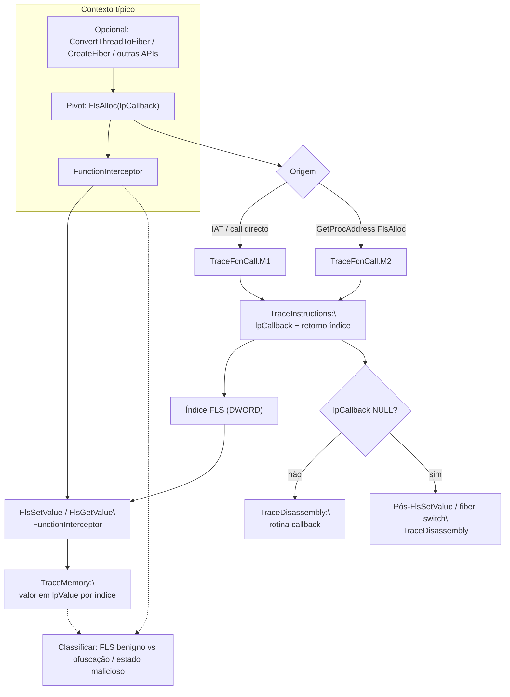

# Fluxo mapeado a partir de `FlsAlloc`

## Escopo e premissa analítica

Este documento segue a mesma metodologia dos fluxos **`legacy_artifacts`** já publicados (**`LoadLibraryA`**, **`CheckRemoteDebuggerPresent`**, **`ZwQueryInformationProcess`**, **`CreateThread`**): correlacionar o pivô **`FlsAlloc`** entre os artefatos **`FunctionInterceptor.cdf`**, **`TraceFcnCall.M1` / `.M2.cdf`**, **`TraceInstructions.cdf`**, **`TraceMemory.cdf`** e **`TraceDisassembly.cdf`**.

**`FlsAlloc`** (API públic Windows, export típico por **`kernel32`** / **`KernelBase`**) **reserva um índice** de ***Fiber Local Storage* (FLS)** e aceita opcionalmente um **`PFLS_CALLBACK_FUNCTION`** chamado quando a *fiber* correspondente ou o *thread* termina e há valor FLS pendente — parâmetro único quando presente nos traces.

Este marco aparece quando a amostra prepara **`FlsAlloc`/`FlsSetValue`/`FlsGetValue`** em conjunto com **`ConvertThreadToFiber`**, **`CreateFiber`**, **`SwitchToFiber`** (ofuscação de fluxo, *anti-analysis* tardia) ou apenas armazena estado por‑*fiber*/por‑protocolo dentro do mesmo modelo de threads. Correlações úteis: **`FlsAlloc` → índice retornado (`DWORD`) → `FlsSetValue`/uso do *slot*`** → eventual encadeamento com **`HeapAlloc`/`VirtualAlloc`** próximo no tempo ou com **`CreateThread`** / *fiber* API [1].

## Papel de cada artefato na correlação

| Artefato Contradef | Papel relativamente a `FlsAlloc` | O que procurar |
|---|---|---|
| **`FunctionInterceptor.cdf`** | Evento **`FlsAlloc(lpCallback)`** e **índice FLS** devolvido | Ordem com **`FlsSetValue`**, **`FlsGetValue`**, **`FlsFree`**, **`ConvertThreadToFiber`**, **`CreateFiber`**, **`SwitchToFiber`**. |
| **`TraceFcnCall.M1.cdf`** | **`call` directo** ao *thunk* de importação | Menos ofuscação. |
| **`TraceFcnCall.M2.cdf`** | **Indirecta**: `GetProcAddress(..., "FlsAlloc")` ou *stub* | *Packer* / carregamento dinâmico. |
| **`TraceInstructions.cdf`** | Preparação do argumento **`lpCallback`** (ponteiro nulo vs rotina de *destructor*); **`CALL`** à API | Decisão se há *callback* FLS (evidência de libertação controlada / *cleanup*). |
| **`TraceMemory.cdf`** | Conteúdo armazenado depois via **`FlsSetValue`** no **índice** retornado; regiões apontadas pelo *callback* | Liga **índice FLS** a **dados** e a **ponteiros de função** suspeitos. |
| **`TraceDisassembly.cdf`** | Corpo do **callback** FLS (se resolvido), ou blocos após **`FlsSetValue`** | Fecha *“o que vive no slot FLS”* e o fluxo de execução após *fiber*/*thread* switch. |

Assinatura (resumo):  
`DWORD FlsAlloc(PFLS_CALLBACK_FUNCTION lpCallback);`  
(`TLS_OUT_OF_INDEXES` / `0xFFFFFFFF` em falha.)

## Cadeia lógica de correlação (ordem sugerida)

1. **`FunctionInterceptor`**: Indexar **`FlsAlloc`** e o **valor de retorno** do **índice FLS** quando exportado.  
2. **`TraceFcnCall.M1`** / **`M2`**: Directa vs indirecta.  
3. **`TraceInstructions`**: Evidência de **`lpCallback`** nulo vs endereço de rotina.  
4. **`FunctionInterceptor`** (de novo) + **`TraceMemory`**: Correlacionar **`FlsSetValue(dwFlsIndex, lpValue)`** com o **mesmo índice** e inspecionar **`lpValue`**.  
5. **`TraceDisassembly`**: Se existir *callback* não nulo, **desmontar** a rotina; caso contrário, seguir execução após **`FlsSetValue`** / ***fiber* switch**.  
6. Relacionar com **`CreateThread`** quando *fibers* e *threads* coexistem no mesmo processo [1].

## Fluxo correlacionado (tabela sintética)

| Ordem | Foco analítico | Artefatos | Resultado esperado |
|---:|---|---|---|
| 1 | `FlsAlloc` + **índice** retornado | `FunctionInterceptor` | IDs FLS activos no trace |
| 2 | Origem **directa** | `TraceFcnCall.M1` | Callee |
| 3 | Origem **indirecta** | `TraceFcnCall.M2` | Resolução dinâmica |
| 4 | **`lpCallback`** e retorno | `TraceInstructions` | Presença/ausência de *destructor* FLS |
| 5 | Valores no *slot* via **`FlsSetValue`** | `TraceMemory` + `FunctionInterceptor` | Dados por índice |
| 6 | Lógica no *callback* ou pós‑*set* | `TraceDisassembly` | Classificação (ofuscação *fiber*, TLS‑like benigno, etc.) |

## Diagrama Mermaid

## Pontos inicial, intermediário e final

| Tipo | Marco | Interpretação |
|---|---|---|
| Contexto | Uso de *fiber* API ou padrão `Fls*` em cadeia [1] | Onde **`FlsAlloc`** encaixa |
| Específico | **`FlsAlloc`** com **índice** útil nos logs | Pivô deste pacote |
| Decisório | **`FlsSetValue`** no mesmo índice + conteúdo em memória | Prova de **estado** transportado por FLS |
| Final | *Callback* ou ramo pós‑*set* | Conclusão analítica |

## Limitações

Se o trace **não** exportar o **retorno** de **`FlsAlloc`**, correlacione por **ordem temporal** com o próximo **`FlsSetValue`** conhecido ou por **padrão de constante** em **`TraceInstructions`**. Resolução **KernelBase** vs **`kernel32`** no nome do símbolo não altera a lógica.

## Referências cruzadas

- [`../../docs/legacy/isdebuggerpresent_flow/fluxo_isdebuggerpresent_mapeado.md`](../../docs/legacy/isdebuggerpresent_flow/fluxo_isdebuggerpresent_mapeado.md) — narrativa global [1].  
- [`../CreateThread/fluxo_createthread_mapeado.md`](../CreateThread/fluxo_createthread_mapeado.md) — *threads* em paralelo a *fibers*.  
- [`../LoadLibraryA/fluxo_loadlibrarya_mapeado.md`](../LoadLibraryA/fluxo_loadlibrarya_mapeado.md) — carga de módulos antes de APIs de *runtime* avançado.  
- [`../isdebuggerpresent_flow/`](../isdebuggerpresent_flow/) — scripts / exemplos.

## Referências

[1] Documentação agregada em `docs/legacy/isdebuggerpresent_flow/` e pacotes `legacy_artifacts/*/`.
