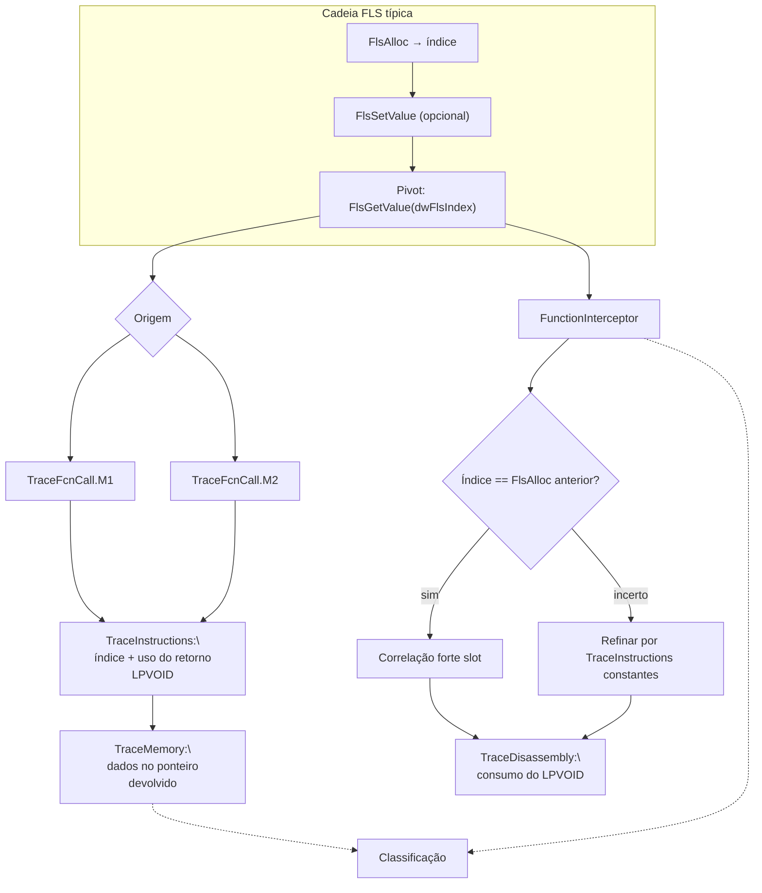

# Fluxo mapeado a partir de `FlsGetValue`

## Escopo e premissa analítica

Este pacote replica a mesma metodologia dos fluxos **`legacy_artifacts`** (incluindo **`FlsAlloc`**, **`CreateThread`**): correlacionar o pivô **`FlsGetValue`** entre **`FunctionInterceptor.cdf`**, **`TraceFcnCall.M1` / `.M2.cdf`**, **`TraceInstructions.cdf`**, **`TraceMemory.cdf`** e **`TraceDisassembly.cdf`**.

**`kernel32`** / **`KernelBase`**: **`FlsGetValue(DWORD dwFlsIndex)`** devolve o **ponteiro** previamente associado ao *slot* FLS através de **`FlsSetValue`** (sobre um **índice** obtido com **`FlsAlloc`** ou reutilizado após ciclo válido na mesma vista de *fiber*/*thread*, conforme o modelo runtime).

Analiticamente **`FlsGetValue`** fecha o triângulo:

**`FlsAlloc` → (opcionalmente) `FlsSetValue` → `FlsGetValue`**

Ou, em leituras posteriores: confirmar **`dwFlsIndex`** (constante nos instrumentos **`TraceInstructions`**) com o mesmo **índice** visto antes no **`FunctionInterceptor`**; seguir **o ponteiro retornado** (**`LPVOID`**) para estruturas, *shellcodes*, ponteiros de função ou handles em **`TraceMemory`/`TraceDisassembly`**.

Assinatura:

`PVOID FlsGetValue(DWORD dwFlsIndex);`  
(em falha comum aparece comportamento **`NULL`/erro último sistema se documentado pelo trace.)

## Papel de cada artefato na correlação

| Artefato Contradef | Papel relativamente a `FlsGetValue` | O que procurar |
|---|---|---|
| **`FunctionInterceptor.cdf`** | Evento **`FlsGetValue(dwFlsIndex)`** e **`LPVOID` retornado** quando exposto | Ordem relativamente a **`FlsAlloc`/`FlsSetValue`/`FlsFree`**. |
| **`TraceFcnCall.M1.cdf`** | **`call` directo** ao *thunk* | Caminho menos ofuscado. |
| **`TraceFcnCall.M2.cdf`** | **Indirecta** (`GetProcAddress`, *stub*) | Evidência de carregamento dinâmico. |
| **`TraceInstructions.cdf`** | Constante **`dwFlsIndex`** (imediato, registo carregado antes do `CALL`); primeiro uso do **retorno** (`mov` para registo/stack) | Correspondência índice‑a‑índice com **`FlsAlloc`** de eventos mais cedo na linha temporal. |
| **`TraceMemory.cdf`** | Objeto ou buffer apontados pelo **`PVOID`** retornado; escritas efectuadas antes com **`FlsSetValue`** | Prova forte de que o estado FLS foi **consumido** em comportamento observable. |
| **`TraceDisassembly.cdf`** | Funções chamadas **imediatamente** após ler o *slot*, ou desvio condicional segundo o ponteiro nulo/non‑null | Narrativa até classificação (estado benigno vs *gate* maligno sobre ponteiro). |

## Cadeia lógica de correlação (ordem sugerida)

1. **`FunctionInterceptor`**: Lista **`FlsGetValue`** ordenada; apanhar **`dwFlsIndex`** e **valor de retorno** quando existirem.  
2. **Correlação cruzada** com **`FlsAlloc`** / **`FlsSetValue`** no **mesmo índice** (por ordem causal ou igualdade literal de constante nos logs).  
3. **`TraceFcnCall.M1`** / **`M2`**.  
4. **`TraceInstructions`**: Confirmar montagem **`dwFlsIndex`**; localizar primeira instrução onde o **valor de retorno** é usado.  
5. **`TraceMemory`**: Interpretar dados em **`LPVOID`**.  
6. **`TraceDisassembly`**: Lógica pós‑*get*.  
7. Se **`FlsFree`** aparecer depois, correlacionar *lifetime* do *slot* [1].

## Fluxo correlacionado (tabela sintética)

| Ordem | Foco analítico | Artefatos | Resultado esperado |
|---:|---|---|---|
| 1 | Índices FLS **`GetValue`** ordenados no tempo | `FunctionInterceptor` | Mapa de leituras de *slots* |
| 2 | Origem **directa** | `TraceFcnCall.M1` | Callee |
| 3 | Origem **indirecta** | `TraceFcnCall.M2` | Resolução dinâmica |
| 4 | **`dwFlsIndex`** + uso do retorno | `TraceInstructions` | Correspondência com **`FlsAlloc`** |
| 5 | Conteúdo apontado pelo **`PVOID`** | `TraceMemory` | Evidência de *payload* / estado |
| 6 | Ramificação pós‑leitura | `TraceDisassembly` | Conclusão analítica |

## Diagrama Mermaid

## Pontos inicial, intermediário e final

| Tipo | Marco | Interpretação |
|---|---|---|
| Contexto | **`FlsAlloc`** / **`FlsSetValue`** já identificados [1] | Onde **`FlsGetValue`** lê estado |
| Específico | **`FlsGetValue`** com **índice** e **retorno** explícitos | Pivô deste documento |
| Decisório | **`LPVOID` não nulo** + destino em **`TraceMemory`** | Prova de *gate* ou handle a dados |
| Final | Ramais em **`TraceDisassembly`** ou **`FlsFree`** subsequente | Fecho temporal do *slot* |

## Limitações

Sem **retorno** explícito no **`FunctionInterceptor`**, seguir o **registo de retorno** da convenção (`RAX`/x64) nos **`TraceInstructions`** imediatamente após o `CALL`, quando o formato do trace permitir.

## Referências cruzadas

- [`../FlsAlloc/fluxo_flsalloc_mapeado.md`](../FlsAlloc/fluxo_flsalloc_mapeado.md) — alocação e *callback*.  
- [`../CreateThread/fluxo_createthread_mapeado.md`](../CreateThread/fluxo_createthread_mapeado.md).  
- [`../../docs/legacy/isdebuggerpresent_flow/fluxo_isdebuggerpresent_mapeado.md`](../../docs/legacy/isdebuggerpresent_flow/fluxo_isdebuggerpresent_mapeado.md) [1].  
- [`../isdebuggerpresent_flow/`](../isdebuggerpresent_flow/).

## Referências

[1] Pacote sintético e `docs/legacy/isdebuggerpresent_flow/`.
