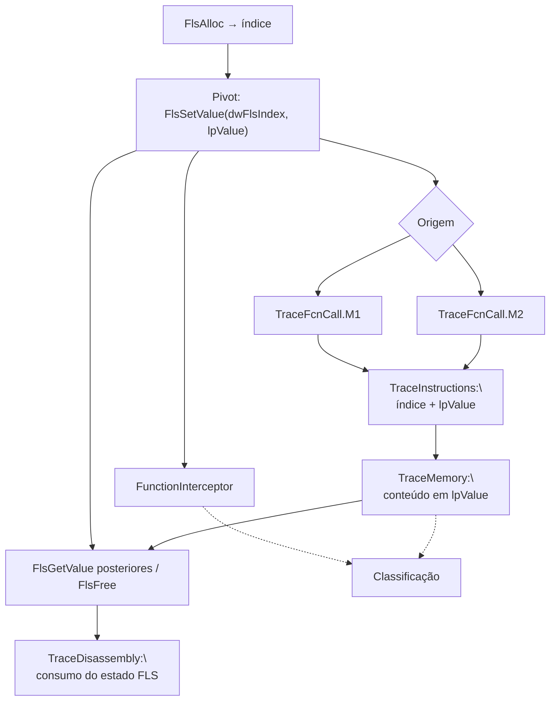

# Fluxo mapeado a partir de `FlsSetValue`

## Escopo e premissa analítica

Este pacote segue a mesma metodologia dos fluxos **`legacy_artifacts`** já publicados (**`FlsAlloc`**, **`FlsGetValue`**, **`CreateThread`**): correlacionar o pivô **`FlsSetValue`** entre **`FunctionInterceptor.cdf`**, **`TraceFcnCall.M1` / `.M2.cdf`**, **`TraceInstructions.cdf`**, **`TraceMemory.cdf`** e **`TraceDisassembly.cdf`**.

**`kernel32`** / **`KernelBase`**, assinatura resumida:

`BOOL FlsSetValue(DWORD dwFlsIndex, PVOID lpValue);`

Define o **valor** do ***slot* FLS** identificado por **`dwFlsIndex`** (normalmente **`FlsAlloc`**) com **`lpValue`** opcional (**`NULL`** limpa segundo as regras do runtime). Esta chamada é o **elo de escrita** entre alocação e leituras subsequentes **`FlsGetValue`**; é também onde aparece frequentemente um **handle**, **ponteiro de função** ou **estrutura** que o analista deve seguir para **`TraceMemory`** / **`TraceDisassembly`** [1].

Cadeia lógica típica documentada nos pacotes irmãos:

**`FlsAlloc` → `FlsSetValue` → (`FlsGetValue` opcional repetido)**

## Papel de cada artefato na correlação

| Artefato Contradef | Papel relativamente a `FlsSetValue` | O que procurar |
|---|---|---|
| **`FunctionInterceptor.cdf`** | **`FlsSetValue(dwFlsIndex, lpValue)`** e **retorno `BOOL`** quando existir | Ordem com **`FlsAlloc`**, **`FlsGetValue`**, **`FlsFree`**, *fiber* APIs. |
| **`TraceFcnCall.M1.cdf`** | **`call` directo** | Menos ofuscação. |
| **`TraceFcnCall.M2.cdf`** | **Indirecta** (`GetProcAddress("FlsSetValue")`, *stub*) | *Packer* / resolução dinâmica. |
| **`TraceInstructions.cdf`** | **Dois argumentos**: constante `dwFlsIndex` + preparação de **`lpValue`** (`lea`/`mov` de ponteiro, empilhamento) | Correspondência de **índice** com evento **`FlsAlloc`** anterior. |
| **`TraceMemory.cdf`** | **Conteúdo em `lpValue`** (bytes no endereço passado) antes do *call*; regiões apontadas (struct, *shellcode*, *vtable*) | Evidência do **estado** armazenado no *slot*. |
| **`TraceDisassembly.cdf`** | Uso do **retorno** / ramos de erro; código que **reutiliza** o mesmo índice logo a seguir | Confirma commit intencional do valor. |

## Cadeia lógica de correlação (ordem sugerida)

1. **`FunctionInterceptor`**: Indexar **`FlsSetValue`** e, quando possível, **`dwFlsIndex`**, **`lpValue`**, **`TRUE`/`FALSE`**.  
2. **Correlação** com **`FlsAlloc`** no **mesmo índice** (constante ou sequência temporal).  
3. **`TraceFcnCall.M1`** / **`M2`**.  
4. **`TraceInstructions`**: Par de argumentos e **constante de índice**.  
5. **`TraceMemory`**: Desreferenciar **`lpValue`**.  
6. **`TraceDisassembly`**: Lógica pós‑*set*; encadear com **`FlsGetValue`** se existir leitura depois.  
7. **`FlsFree`** ou término de *fiber*/*thread* para *lifetime* do *slot* [1].

## Fluxo correlacionado (tabela sintética)

| Ordem | Foco analítico | Artefatos | Resultado esperado |
|---:|---|---|---|
| 1 | Escritas `FlsSetValue` ordenadas | `FunctionInterceptor` | Mapa de atribuições ao *slot* |
| 2 | Origem **directa** | `TraceFcnCall.M1` | Callee |
| 3 | Origem **indirecta** | `TraceFcnCall.M2` | Resolução dinâmica |
| 4 | **`dwFlsIndex`** + **`lpValue`** | `TraceInstructions` | Match com **`FlsAlloc`** |
| 5 | Bytes no endereço **`lpValue`** | `TraceMemory` | *Payload* / estado |
| 6 | Continuação de fluxo | `TraceDisassembly` | Classificação |

## Diagrama Mermaid

## Pontos inicial, intermediário e final

| Tipo | Marco | Interpretação |
|---|---|---|
| Contexto | **`FlsAlloc`** prévio [1] | Índice válido |
| Específico | **`FlsSetValue`** com **`lpValue`** não trivial | Pivô deste documento |
| Decisório | **`TraceMemory`** em **`lpValue`** | Prova de que foi escrito **significado** no *slot* |
| Final | **`FlsGetValue`** ou encerramento / **`FlsFree`** | Fecho da cadeia |

## Limitações

Se **`lpValue`** for **transitório** (stack / *buffer* reutilizado), correlacionar **timestamp** ou **cópia** em **`TraceMemory`** logo antes do `CALL`.

## Referências cruzadas

- [`../FlsAlloc/fluxo_flsalloc_mapeado.md`](../FlsAlloc/fluxo_flsalloc_mapeado.md).  
- [`../FlsGetValue/fluxo_flsgetvalue_mapeado.md`](../FlsGetValue/fluxo_flsgetvalue_mapeado.md).  
- [`../../docs/legacy/isdebuggerpresent_flow/fluxo_isdebuggerpresent_mapeado.md`](../../docs/legacy/isdebuggerpresent_flow/fluxo_isdebuggerpresent_mapeado.md) [1].  
- [`../isdebuggerpresent_flow/`](../isdebuggerpresent_flow/).

## Referências

[1] Pacotes `legacy_artifacts/*/`, `docs/legacy/isdebuggerpresent_flow/`.
