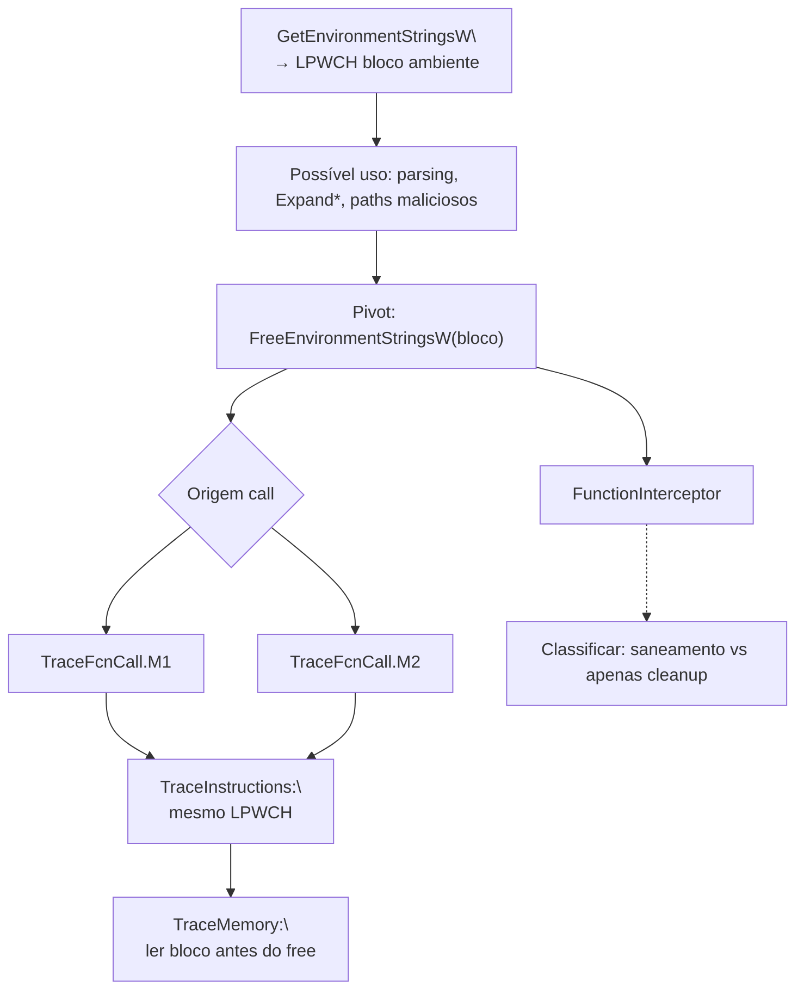

# Fluxo mapeado a partir de `FreeEnvironmentStringsW`

## Escopo e premissa analítica

Este pacote segue a mesma metodologia dos fluxos **`legacy_artifacts`** (**`LoadLibraryA`**, **`FlsSetValue`**, **`CreateThread`**): correlacionar o pivô **`FreeEnvironmentStringsW`** entre **`FunctionInterceptor.cdf`**, **`TraceFcnCall.M1` / `.M2.cdf`**, **`TraceInstructions.cdf`**, **`TraceMemory.cdf`** e **`TraceDisassembly.cdf`**.

**`kernel32!FreeEnvironmentStringsW`** liberta o bloco retornado por **`GetEnvironmentStringsW`** (não confundir com o bloco de entrada de processo lido por outras APIs). Assinatura habitual:

`BOOL FreeEnvironmentStringsW(LPWCH pEnvironmentStrings);`

O par **obtido com `GetEnvironmentStringsW` → libertado com `FreeEnvironmentStringsW`** é o eixo típico. Em malícia, a leitura de variáveis de ambiente aparece antes de decisões sobre **caminhos** (`TEMP`, `%APPDATA%`, `PATH` para DLL search), **staging**, ou mascaramento; **`FreeEnvironmentStringsW`** marca o **fecho da secção “enumerar/leu o bloco de ambiente UTF‑16″** — correlacionável com o mesmo **ponteiro** antes exposto pela API de obtenção **e** opcionalmente com utilização intermédia em **`ExpandEnvironmentStrings*`** ou *parsing* manual [1].

## Papel de cada artefato na correlação

| Artefato Contradef | Papel relativamente a `FreeEnvironmentStringsW` | O que procurar |
|---|---|---|
| **`FunctionInterceptor.cdf`** | **`FreeEnvironmentStringsW(pEnvironmentStrings)`** após **`GetEnvironmentStringsW`**; **retorno `BOOL`** | Ordem causal; igualdade de **ponteiro** aos eventos **`Get*`** anteriores quando o trace preserva argumentos. |
| **`TraceFcnCall.M1.cdf`** | **`call` directo** | Menos ofuscação. |
| **`TraceFcnCall.M2.cdf`** | **`GetProcAddress`**, delayed | Resolução dinâmica. |
| **`TraceInstructions.cdf`** | Único argumento **`LPWCH`** (registo/stack); que registo segurou o ponteiro retornado antes | **Mesmo endereço** que **`GetEnvironmentStringsW`** na janela temporal. |
| **`TraceMemory.cdf`** | **Bloco antes do *free*** (lista `NAME=value\0 … \0\0`**); possíveis escritas antes da libertação pelo *sample*** | Keywords suspeitos em `PATH`; *paths* relativos ao *staging*. |
| **`TraceDisassembly.cdf`** | Bloco antes/depois do *free*: *parser* próprio sobre o buffer antes de **`Free*`** ou ramos erro se **`Get*`** falhou | Narrativa até classificação. |

## Cadeia lógica de correlação (ordem sugerida)

1. **`FunctionInterceptor`**: Agrupar **`GetEnvironmentStringsW`** seguidos (no tempo) de **`FreeEnvironmentStringsW`**.  
2. **Igualdade de ponteiro** entre os dois onde o formato do log trouxer endereços.  
3. **`TraceFcnCall.M1`** / **`M2`**.  
4. **`TraceInstructions`**: **`CALL`** a **`FreeEnvironmentStringsW`** ; registo‑fonte igual ao último **`Get*`**.  
5. **`TraceMemory`**: Ler conteúdo do bloco antes do *free*.  
6. **`TraceDisassembly`**: código entre **`Get*`** e **`Free*`**.  
7. Alternativa `GetEnvironmentStrings`** (ANSI): outro **`FreeEnvironmentStrings`** (sem **W**) no mesmo papel — mesmo raciocínio se o pivô aparecer assim no trace [1].

## Fluxo correlacionado (tabela sintética)

| Ordem | Foco analítico | Artefatos | Resultado esperado |
|---:|---|---|---|
| 1 | Marcos `Get*` / **`FreeEnvironmentStringsW`** ordenados | `FunctionInterceptor` | Pares válidos lifecycle |
| 2 | Origem **directa** | `TraceFcnCall.M1` | |
| 3 | Origem **indirecta** | `TraceFcnCall.M2` | |
| 4 | Argumento **`lpEnvironmentStrings`** | `TraceInstructions` | Match de ponteiro |
| 5 | Conteúdo **UTF‑16** do bloco | `TraceMemory` | Paths / variáveis |
| 6 | Lógica intermédia | `TraceDisassembly` | Classificação |

## Diagrama Mermaid

## Pontos inicial, intermediário e final

| Tipo | Marco | Interpretação |
|---|---|---|
| Início causal | **`GetEnvironmentStringsW`** com ponteiro P | Obtenção das variáveis de ambiente |
| Específico | **`FreeEnvironmentStringsW(P)` com P coerente** | Pivô deste artefacto |
| Intermediário | Conteúdo em **`TraceMemory`** entre leituras e *free* | Intenção (paths, sandbox, etc.) |
| Final | *Free* executado ou ramo erro | Ciclo ambiental fechado |

## Limitações

Se apenas **`FreeEnvironmentStringsW`** surge sem **`Get*`** próximo nos logs, recuperar **`Get*`** numa ordenação maior ou **outro PID/fiber** segundo o modelo Contradef; ou o ponteiro pode ser **`NULL`** (NOP documentado MSDN comportamento dependente).

## Referências cruzadas

- [`../LoadLibraryA/fluxo_loadlibrarya_mapeado.md`](../LoadLibraryA/fluxo_loadlibrarya_mapeado.md) — *paths* e DLL por diretório.  
- [`../../docs/legacy/isdebuggerpresent_flow/fluxo_isdebuggerpresent_mapeado.md`](../../docs/legacy/isdebuggerpresent_flow/fluxo_isdebuggerpresent_mapeado.md) [1].  
- [`../isdebuggerpresent_flow/`](../isdebuggerpresent_flow/).

## Referências

[1] `docs/legacy/isdebuggerpresent_flow/`, relatórios agregados do repositório.
