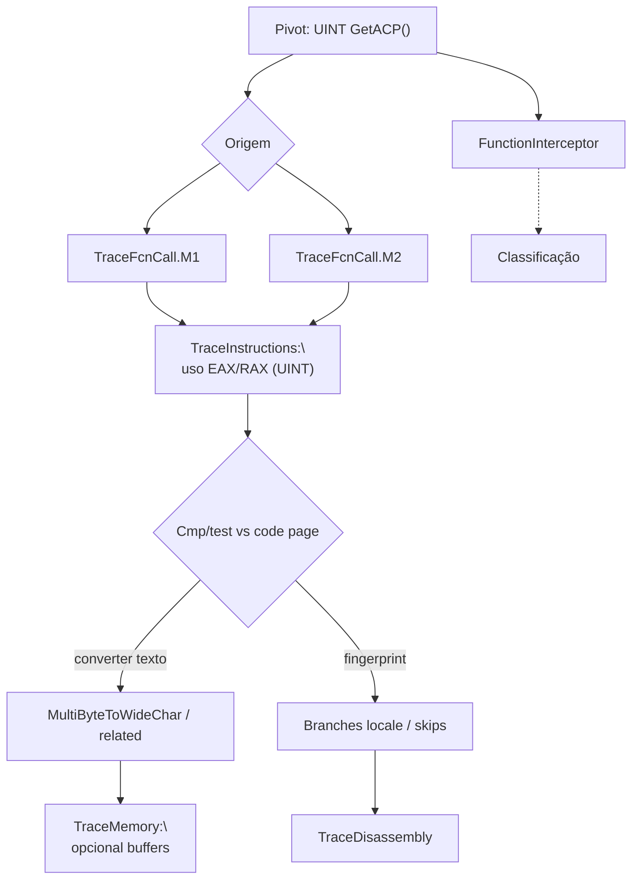

# Fluxo mapeado a partir de `GetACP`

## Escopo e premissa analítica

Este pacote segue a mesma metodologia dos fluxos **`legacy_artifacts`** (**`LoadLibraryA`**, **`FreeEnvironmentStringsW`**, **`FlsSetValue`**): correlacionar o pivô **`GetACP`** entre **`FunctionInterceptor.cdf`**, **`TraceFcnCall.M1` / `.M2.cdf`**, **`TraceInstructions.cdf`**, **`TraceMemory.cdf`** e **`TraceDisassembly.cdf`**.

**`kernel32!GetACP`** não recebe argumentos. Devolve **`UINT`**: o **identificador da *code page ANSI* activa** para o *thread* actual (p.ex. **1252** Windows Western, **850** OEM legado, conforme configuração regional). Assinatura:

`UINT GetACP(void);`

Em análise forense aparece frequentemente **antes** ou **junto** de conversões **`MultiByteToWideChar`**, **`WideCharToMultiByte`**, *parsing* de *strings* ANSI, ou decisões de codificação na rede e ficheiros — e por vezes só como **marcador de *fingerprinting*** (ambiente régional / *locale*). Correlação típica:

**`GetACP` → retorno em registo → `cmp`/`test` imediato → ramo** em **`TraceInstructions`/`TraceDisassembly`**, ou **encadeamento explícito** a **`GetOEMCP`**, **`GetCPInfo`**, **`SetThreadLocale`**, et cetera [1].

## Papel de cada artefato na correlação

| Artefato Contradef | Papel relativamente a `GetACP` | O que procurar |
|---|---|---|
| **`FunctionInterceptor.cdf`** | Chamada **`GetACP()`** e **`UINT` retornado** se o trace expuser | Proximidade temporal com conversões de texto, *parsing*, ou outras APIs de *locale*. |
| **`TraceFcnCall.M1.cdf`** | **`call` directo** | Uso estático de **`kernel32`**. |
| **`TraceFcnCall.M2.cdf`** | **Indirecta** | *GetProcAddress* ou *stub* de *packer*. |
| **`TraceInstructions.cdf`** | Após o `CALL`, **valor imediato** em `cmp`/`test` contra **1252**, **936**, etc.; ou primeiro uso do **`EAX`**/**`RAX`** | Prova de ramificação por *code page*. |
| **`TraceMemory.cdf`** | Menos directa; útil se o retorno for **escrito** numa estrutura/tabela antes de usar | Buffers de texto resultantes das conversões que dependem do ACP. |
| **`TraceDisassembly.cdf`** | Função *wrapper* ao redor da consulta ao ACP ou tabela **`switch`/lookup** sobre o valor | Narrativa até classificação (*packer regional*, *sandbox* por *locale*, lógica benigna). |

## Cadeia lógica de correlação (ordem sugerida)

1. **`FunctionInterceptor`**: Lista **`GetACP`** e **retorno numérico** quando existir.  
2. **`TraceFcnCall.M1`** / **`M2`**.  
3. **`TraceInstructions`**: Consumo do **`UINT`** nas próximas instruções (**`mov`/`cmp`**).  
4. Correlações com **`MultiByteToWideChar`** / **`LoadLibraryA`** (argumentos **`A`** vs **`W`**).  
5. **`TraceMemory`** apenas se converter blocos texto — secundário.  
6. **`TraceDisassembly`**: bloco inteiro ao redor da chamada.

## Fluxo correlacionado (tabela sintética)

| Ordem | Foco analítico | Artefatos | Resultado esperado |
|---:|---|---|---|
| 1 | Marcos `GetACP` + retorno | `FunctionInterceptor` | Valores observados ao longo do trace |
| 2 | Origem **directa** | `TraceFcnCall.M1` | |
| 3 | Origem **indirecta** | `TraceFcnCall.M2` | |
| 4 | Uso imediato do retorno (**`UINT`**) | `TraceInstructions` | Ramificações ou parâmetro a conversions |
| 5 | Buffers texto dependentes — quando aplicável | `TraceMemory` | |
| 6 | Lógica de alto nível | `TraceDisassembly` | Classificação |

## Diagrama Mermaid

## Pontos inicial, intermediário e final

| Tipo | Marco | Interpretação |
|---|---|---|
| Específico | **`GetACP`** com **retorno** explícito | Pivô deste documento |
| Intermediário | Ramificação por constante (**CP**) | Escolhas condicionadas ao locale |
| Final | Fluxo até conversão/execução | Conclusão analítica [1] |

## Limitações

API **sem argumentos**: se **`FunctionInterceptor`** não gravar **retorno**, usar **`TraceInstructions`** pós‑`CALL` (convenção de chamada **`UINT`** em **`EAX`/`RAX`** no x86/x64 *Microsoft ABI*).

## Referências cruzadas

- [`../FreeEnvironmentStringsW/fluxo_freeenvironmentstringsw_mapeado.md`](../FreeEnvironmentStringsW/fluxo_freeenvironmentstringsw_mapeado.md) — ambiente e *strings*.  
- [`../LoadLibraryA/fluxo_loadlibrarya_mapeado.md`](../LoadLibraryA/fluxo_loadlibrarya_mapeado.md) — paths ANSI.  
- [`../../docs/legacy/isdebuggerpresent_flow/fluxo_isdebuggerpresent_mapeado.md`](../../docs/legacy/isdebuggerpresent_flow/fluxo_isdebuggerpresent_mapeado.md) [1].  
- [`../isdebuggerpresent_flow/`](../isdebuggerpresent_flow/).

## Referências

[1] `docs/legacy/isdebuggerpresent_flow/`, pacotes agregados no repositório.
