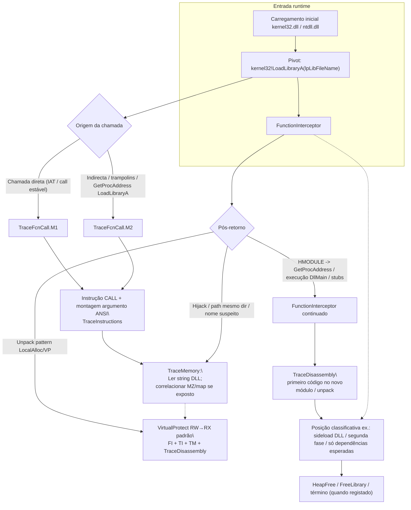

# Fluxo mapeado a partir de `LoadLibraryA`

## Escopo e premissa analítica

Este documento replica a metodologia do fluxo **`IsDebuggerPresent`** (cadeia Contradef entre `FunctionInterceptor`, `TraceFcnCall.M1` / `TraceFcnCall.M2`, `TraceInstructions`, `TraceMemory` e `TraceDisassembly`), usando como pivô a API **`LoadLibraryA`** (`kernel32.dll`) — carregamento de módulo pelo **nome/path ASCII** (`LPCSTR`).

`LoadLibraryA` é um marco frequente em malícia e em proteções: *DLL search-order hijacking*, carregamento de *stubs* de unpacking, resolução tardia de dependências, ou *proxy* de bibliotecas legítimas. Para análise forense com os mesmos ficheiros Contradef (`contradef.*.FunctionInterceptor.cdf`, `TraceFcnCall.M1.cdf`, `TraceFcnCall.M2.cdf`, `TraceInstructions.cdf`, `TraceMemory.cdf`, `TraceDisassembly.cdf`), o analista concatena o **evento de API** ao **call site**, ao **contexto de dados** (cadeia de caracteres apontada) e ao **uso do `HMODULE` devolvido**.

## Papel de cada artefazo na correlação

| Artefato Contradef | Papel relativamente a `LoadLibraryA` | O que procurar |
|---|---|---|
| **`FunctionInterceptor.cdf`** | Evento soberano da chamada/recuperação ao `kernel32!LoadLibraryA` | Ordem cronológica, thread, eventual retorno `(HMODULE)` e encadeamentos para `LoadLibraryExA`, `GetModuleHandle*` ou `FreeLibrary`. |
| **`TraceFcnCall.M1.cdf`** | **Chamadas diretas** convencionais (IAT, `call` estável ao *thunk* de importação) | Calle ligado ao módulo principal ou a DLL já mapeadas; menor ofuscação. |
| **`TraceFcnCall.M2.cdf`** | **Chamadas indiretas**: *trampolins*, ponteiros resolvidos em tempo de execução, **`GetProcAddress(..., "LoadLibraryA")`**, loaders em stub | Origem menos óbvia; típico com *packers* ou carregamento dinâmico. |
| **`TraceInstructions.cdf`** | Instrução exata antes/depois do `call`; preparação dos argumentos (ponteiro da *string* do caminho DLL) | Instruções que empurram o endereço da sequência ANSI a carregar (`push`, `lea`, registos cargados antes do `CALL`). |
| **`TraceMemory.cdf`** | **Leitura da *string*** do DLL no espaço do processo; zonas escritas/le após falha ou sucesso; mapas próximos a `MZ` quando o loader já materializa a imagem | Correlação do path (p.ex. mesmo directório da amostra, `%TEMP%`, nomes curtos pseudo-aleatórios) com o retorno de `LoadLibraryA`. |
| **`TraceDisassembly.cdf`** | Blocos básicos onde o resultado é usado: `DllMain`-induced effects, primeira instruções no módulo carregado, ou stubs que despacham para `VirtualProtect` / `memcpy` logo após carga | Fecho da lógica “carregámos isto para depois fazer…” (unpack / exec.). |

## Cadeia lógica de correlação (ordem de trabalho sugerida)

1. **`FunctionInterceptor`**: Confirmar marca(s) **`LoadLibraryA`** (e variantes relacionadas quando relevante: **`LoadLibraryW` não passa pela mesma entrada A**, mas aparece paralela como decisão estratégica do autor).
2. **`TraceFcnCall.M1`** vs **`TraceFcnCall.M2`**: Classificar cada ocorrência em **directa** ou **indireta/dinâmica**; registar IPs de retorno e de call site.
3. **`TraceInstructions`**: Ancorar por **referência próxima** (mesmo *timestamp* ordenado ou `RIP`/PC do trace) ao `call`; extrair evidência sobre **como** o argumento ASCII foi montado (stack, registo, *heap* constante embutido).
4. **`TraceMemory`**: Ler o **buffer do path**; validar se o path sugere hijack (DLL junto ao executável), *phantom DLL*, ou cargas apenas de libs de sistema esperáveis nesta fase da execução.
5. **`TraceDisassembly`**: Para o mesmo intervalo causal, relacionar execuções no **módulo recém-mapeado** e no **callsite** posterior (p.ex. `GetProcAddress` sobre o handle devolvido, ou entrada em unpacking).

Para ficheiros muito grandes (**`TraceInstructions`**, **`TraceMemory`**), trabalhar primeiro com recortes filtrados pela janela temporal ou pelo endereço do `call site` já estabelecido em `FunctionInterceptor` / `TraceFcnCall`, evitando leitura integral linear.

## Diagrama de fluxo (equivalente estrutural ao de `IsDebuggerPresent`)

Versão texto; diagrama Mermaid equivalente aparece mais abaixo.

1. **Carregamento base de runtime** (`kernel32` / `ntdll` já no processo) — **`FunctionInterceptor`**.  
2. **Alvo: `LoadLibraryA(lpLibFileName)`** — **`FunctionInterceptor`**.  
3. **Ramo de origem da chamada**  
   - **Esquerda (direta)**: **`TraceFcnCall.M1`**  
   - **Direita (indireta / API dinâmica)**: **`TraceFcnCall.M2`**  
4. **Confluência**: **Argumentos e instrução exata à entrada de `LoadLibraryA`** — **`TraceInstructions`**.  
5. **Ramificações típicas pós-sucesso no loader** *(escolhas analíticas, não bifurcação exclusiva no mesmo instante)*:  
   - **Uso benigno/contexto esperado**: resoluções no *Search Path* padrão, dependências tardias declaradas. Continuações em **`FunctionInterceptor`** (p.ex. `GetProcAddress`, `DllMain`-visible effects via chamadas seguintes conforme tooling).  
   - **Suspeita de *hijacking* / cargas paralelas ao dir. da amostra**: mesmo conjunto **`FunctionInterceptor` + `TraceFcnCall` + `TraceInstructions`**, com forte peso **`TraceMemory`** na *string*.  
   - **Desempacotamento / marcação RX após nova imagem**: padrões semelhantes ao fluxo isolado pelo `IsDebuggerPresent` — **`FunctionInterceptor`** → **`TraceInstructions`** → **`TraceMemory`** → **`TraceDisassembly`**.  
6. **Prova de destino**: **primeira execução no módulo carregado** ou **delegação unpack** — **`TraceDisassembly`** + **`TraceInstructions`**.  
7. **Saídas descritivas**  
   - **Classificação de intenção** (ex.: *trojan DLL sideload*, *launcher* multifase, apenas dependências legítimas).  
   - **Ou encerramento** (`FreeLibrary`, término de thread, erro `LoadLibraryA`/`GetLastError` visível conforme modelo de trace).

## Fluxo correlacionado (tabela sintética)

| Ordem | Foco analítico | Arquivos | Resultado esperado |
|---:|---|---|---|
| 1 | Marcos de carregamento e primeiro `LoadLibraryA` “de interesse” | `FunctionInterceptor` | Lista de chamadas ordenada; filtros sobre path retornado quando exposto pelo trace |
| 2 | Origem **direta** | `TraceFcnCall.M1` | Bloco chamador determinístico |
| 3 | Origem **indireta** | `TraceFcnCall.M2` | Cadeias com `GetProcAddress`/`call reg`/`jmp` retardado |
| 4 | Instrução e setup do argumento | `TraceInstructions` | Evidência de qual *string* é carregada |
| 5 | Bytes do path / imagem em mapa | `TraceMemory` | Prova de nome de ficheiro e regiões alinhadas ao loader |
| 6 | Pós-retorno ao caller e entrada no novo módulo | `TraceDisassembly` | Contexto unpacked / ramos após handle válido |

## Diagrama Mermaid

## Pontos inicial, intermediário e final (espelho do documento IsDebuggerPresent)

| Tipo de marco | Evento típico | Interpretação |
|---|---|---|
| Inicial contextual | Base de processo e imports do módulo principal | Contexto antes do primeiro `LoadLibraryA` analisado |
| Inicial específico | Entrada bem-sucedida no `kernel32!LoadLibraryA` com evidência dos argumentos | Início da cadeia de carga estudada |
| Intermediário decisivo | Correlação M1 vs M2 + *string* + eventual `GetProcAddress` sobre o novo `HMODULE` | Prova-se intenção (estática vs dinâmica) e nome do módulo |
| Final analítico | Classificação (sideload, stub de unpacking, apenas dependências) ou erro explícito de carga | Conclusão técnica replicável entre fichas |

## Limitações

Como nos restantes documentos desta série, valores exatos (**offsets**, **timestamps** absolutos nos `*.cdf` brutos) dependem dos ficheiros reais (`contradef.2956.*.cdf`). O fluxo acima está **estruturalmente correto para correlação** entre os artefatos Contradef; a operacionalização com linha do tempo fechada exige filtros/recortes sobre os grandes volumes (**`TraceInstructions`**, **`TraceMemory`**) assim que disponíveis.

## Referências cruzadas

- Fluxo paralelo em **`IsDebuggerPresent`**: [`docs/legacy/isdebuggerpresent_flow/fluxo_isdebuggerpresent_mapeado.md`](../../docs/legacy/isdebuggerpresent_flow/fluxo_isdebuggerpresent_mapeado.md)  
- Pacote relacionado sob `legacy_artifacts/isdebuggerpresent_flow/` (scripts/exemplos do fluxo `IsDebuggerPresent`).  
- Nomes típicos de ficheiros no lote exemplo:  
  `FunctionInterceptor`, `TraceDisassembly`, `TraceFcnCall.M1`, `TraceFcnCall.M2`, `TraceInstructions`, `TraceMemory`.
