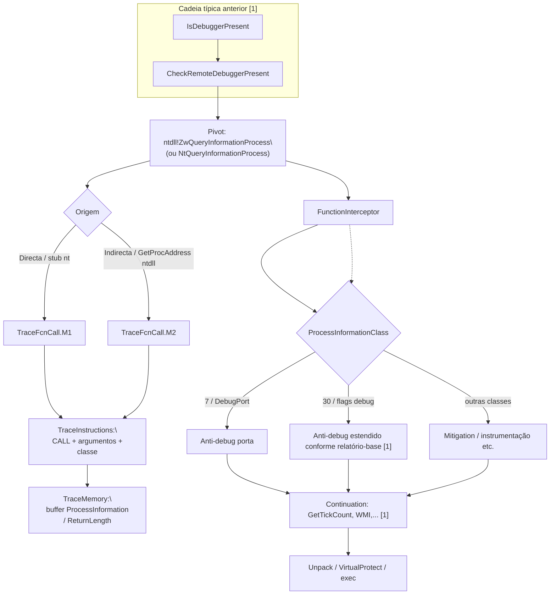

# Fluxo mapeado a partir de `ZwQueryInformationProcess`

## Escopo e premissa analítica

Este pacote usa a mesma metodologia que os fluxos em **`legacy_artifacts`** para **`IsDebuggerPresent`**, **`LoadLibraryA`** e **`CheckRemoteDebuggerPresent`**: correlacionar o pivô **`ZwQueryInformationProcess`** entre os artefactos **`FunctionInterceptor.cdf`**, **`TraceFcnCall.M1` / `.M2.cdf`**, **`TraceInstructions.cdf`**, **`TraceMemory.cdf`** e **`TraceDisassembly.cdf`**.

Na API oficial do modo utilizador **`ntdll`** exporta dois *thunks* muito próximos: **`ZwQueryInformationProcess`** e **`NtQueryInformationProcess`**. Nos mesmos registos Contradef, o símbolo visível pode ser **`Zw...`** ou **`Nt...`** consoante a camada onde a ferramenta ancorou (*stub* antes/depois do transição ao núcleo). Em **correlação analítica**, trate ambos como **o mesmo marco lógico** — o decisivo é o triplo **`ProcessInformationClass`** + **`ProcessInformation`** + comprimento/TLS de retorno, não a etiqueta `Zw` vs `Nt`.

O pivô relevante para **anti‑debug** costuma ser o triplo:

- **`ProcessHandle`** (muitas vezes pseudo‑handle do processo corrente),
- **`ProcessInformationClass`** — classes tipicamente citadas em relatórios de malware: **7** (`ProcessDebugPort`), **30** (equivalente atual de “processo sob depuração”), **ProcessDebugFlags** / **ProcessDebugObjectHandle** em variantes conforme sistema,
- **`ProcessInformation`** + **`ProcessInformationLength`**: zona de dados que alimentará decisões seguintes (**`TraceMemory`**).

Para o relatório‑resumo que encadeava **`CheckRemoteDebuggerPresent`** → **`NtQueryInformationProcess(ProcessInformationClass=30)`**, o fluxo abaixo coloca **`ZwQueryInformationProcess`** como vértice **`ntdll`** paralelo, com o mesmo critério de correlação multi‑arte [1].

## Papel de cada artefacto na correlação

| Artefacto Contradef | Papel relativamente a `ZwQueryInformationProcess` | O que procurar |
|---|---|---|
| **`FunctionInterceptor.cdf`** | Evento **`ZwQueryInformationProcess` / `NtQueryInformationProcess`** com argumentos quando o trace exportar classe e apontadores | Marcos na ordem com **`IsDebuggerPresent`**, **`CheckRemoteDebuggerPresent`**, outros `Zw*` suspeitos. |
| **`TraceFcnCall.M1.cdf`** | Chamada **directa** ao *syscall stub* típico de `ntdll` | Pouco frequente código “honesto”; directo sugere menos ofuscação. |
| **`TraceFcnCall.M2.cdf`** | **Indirecta**, *GetProcAddress* em **`ntdll`**, trampolins de *loader* ou *unpack* | Esperado quando o código evita símbolo explícito. |
| **`TraceInstructions.cdf`** | **`CALL`** no *stub* ou no `syscall`; cargas **`mov`/`lea`** antes do `CALL`; **filtro pela constante literal da classe** se aparecer antes do call | Ramos após syscall que testam ` NTSTATUS ` ou inteiro derivado na stack/registo. |
| **`TraceMemory.cdf`** | **Buffer de informação**: leituras/escritas após o retorno; regiões de **PROCESS_BASIC_INFORMATION**, **debugger port**, **flags**, conforme classe | Prova forte de **uso efectivo do resultado**. |
| **`TraceDisassembly.cdf`** | Ordem das verificações de anti‑debug; blocos onde o anti‑analysis escolhe *branch* antes de unpacking | Junta‑se aos ramos já descritos no fluxo `IsDebuggerPresent` [1]. |

## Cadeia lógica de correlação (ordem de trabalho sugerida)

1. **`FunctionInterceptor`**: Índice todas as **`ZwQueryInformationProcess`** (e **`Nt...`** equiparáveis); **extrair sempre que possível** `ProcessInformationClass` e vínculos temporais com **`CheckRemoteDebuggerPresent`** [1].  
2. **`TraceFcnCall.M1`** vs **`M2`**: Origem directa/indirecta por ocorrência.  
3. **`TraceInstructions`**: Correlação de **syscall**/`CALL` ao **valor de classe** (literal ou registos) à **decisão** subsequente (`test`/`cmp`).  
4. **`TraceMemory`**: Validar **`ProcessInformation`** (tamanhos coerentes com a classe) e consumo pelo caller.  
5. **`TraceDisassembly`**: Situar a rotina dentro da **sequência macro** (“debug check → temporal → VM … → unpacked code”) descrita ao nível **`IsDebuggerPresent`** [1].

Para ficheiros muito grandes, filtrar por **janela temporal** aos redores do evento já indexado ou por **valor de classe**.

## Fluxo correlacionado (tabela sintética)

| Ordem | Foco analítico | Artefactos | Resultado esperado |
|---:|---|---|---|
| 1 | Lista ordenada **`Zw**/Nt`** + **`ProcessInformationClass`** | `FunctionInterceptor` | Mapa de anti‑debug “profundo” |
| 2 | Origem directa | `TraceFcnCall.M1` | Bloco chamador |
| 3 | Origem indirecta | `TraceFcnCall.M2` | Evasão de símbolo explícito |
| 4 | **Setup de argumentos** e condicionais pós‑retorno | `TraceInstructions` | Decisão em função do buffer |
| 5 | **Conteúdo do buffer** de processo | `TraceMemory` | Evidência de debug / handle / flags |
| 6 | Contexto de bloco e continuação | `TraceDisassembly` | Posição na cadeia global [1] |

## Diagrama Mermaid

## Pontos inicial, intermediário e final

| Tipo | Marco | Interpretação |
|---|---|---|
| Contexto | Logo após checagens em **`kernel32`** no fluxo relatório | Entrada típica no “nível **`nt`**” das verificações [1]. |
| Início específico | `Zw`/`NtQueryInformationProcess` com classe ligada à análise (anti‑debug) | Pivô deste artefacto. |
| Decisório | Correlação **classe + buffer + ramo máquina** (`TraceInstructions` + `TraceMemory`) | Prova de **interpretação efectiva**. |
| Final | Ligação aos passos seguintes (**temporais**, **VM**, **unpack**) [1] | Fecho da narração a nível relatório. |

## Limitações

Resolução de símbolos (**`Zw` vs `Nt`**) nos `*.cdf` pode variar; unificar pela **assinatura lógica** e por **classe**. Validação evidencial forte exige dados exportados de cada arquivo.

## Referências cruzadas

- [`../../docs/legacy/isdebuggerpresent_flow/fluxo_isdebuggerpresent_mapeado.md`](../../docs/legacy/isdebuggerpresent_flow/fluxo_isdebuggerpresent_mapeado.md) — cadeia `IsDebuggerPresent` até classificação [1].  
- [`../CheckRemoteDebuggerPresent/fluxo_checkremotedebuggerpresent_mapeado.md`](../CheckRemoteDebuggerPresent/fluxo_checkremotedebuggerpresent_mapeado.md) — elo anterior habitual.  
- [`../LoadLibraryA/fluxo_loadlibrarya_mapeado.md`](../LoadLibraryA/fluxo_loadlibrarya_mapeado.md) — outro exemplo de correlação multi‑log.  
- [`../isdebuggerpresent_flow/`](../isdebuggerpresent_flow/) — scripts CSV / exemplos.

## Referências

[1] Relatório e documentação agregadas no repositório na pasta `docs/legacy/isdebuggerpresent_flow/` e pacotes `legacy_artifacts/*/`.
