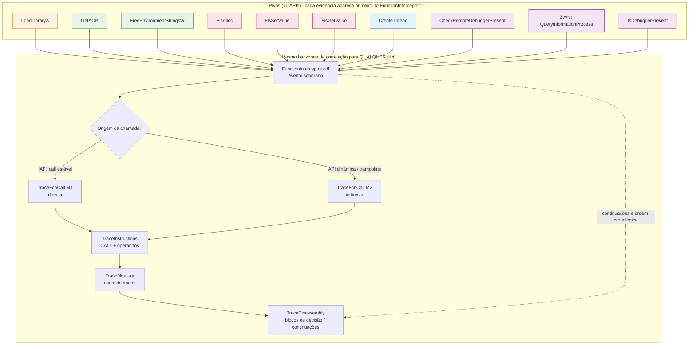
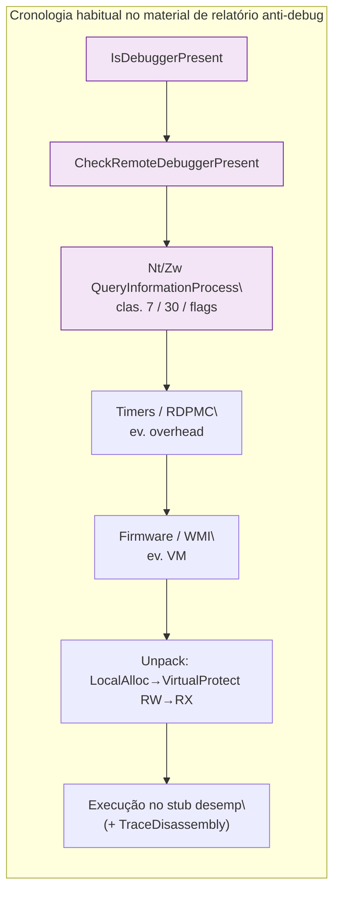

# Metodologia unificada — dez pivôs e `TraceFcnCall.M1` (Contradef)

Este documento consolida, num **único fluxo conceptual**, os mapeamentos já publicados em [`legacy_artifacts`](https://github.com/margefson/AI_correlacion_contradef/tree/main/legacy_artifacts): cada pasta de função usa a **mesma cadeia de correlação** entre artefatos; o que muda entre funções é o **rótulo da API pivô**, o **tipo de dados** evidenciados em **`TraceInstructions`** / **`TraceMemory`**, e, num subconjunto, o **encadeamento macro** (anti‑debug) descrito nos textos-base.

Serve para **validar** se um JSON de fluxo produzido automaticamente pela análise “bate” **no sentido esperado** com esta metodologia (ver § [Comparar com o JSON e com o grafo da aplicação web](#comparar-com-o-json-e-com-o-grafo-da-aplicação-web)).

---

## Lista dos dez pontos focais e documentos-fonte

| # | Função pivô | Documentos de fluxo / pacote |
|---|-------------|------------------------------|
| 1 | `LoadLibraryA` | [`LoadLibraryA/fluxo_loadlibrarya_mapeado.md`](LoadLibraryA/fluxo_loadlibrarya_mapeado.md) |
| 2 | `GetACP` | [`GetACP/fluxo_getacp_mapeado.md`](GetACP/fluxo_getacp_mapeado.md) |
| 3 | `FreeEnvironmentStringsW` | [`FreeEnvironmentStringsW/fluxo_freeenvironmentstringsw_mapeado.md`](FreeEnvironmentStringsW/fluxo_freeenvironmentstringsw_mapeado.md) |
| 4 | `FlsAlloc` | [`FlsAlloc/fluxo_flsalloc_mapeado.md`](FlsAlloc/fluxo_flsalloc_mapeado.md) |
| 5 | `FlsSetValue` | [`FlsSetValue/fluxo_flssetvalue_mapeado.md`](FlsSetValue/fluxo_flssetvalue_mapeado.md) |
| 6 | `FlsGetValue` | [`FlsGetValue/fluxo_flsgetvalue_mapeado.md`](FlsGetValue/fluxo_flsgetvalue_mapeado.md) |
| 7 | `CreateThread` | [`CreateThread/fluxo_createthread_mapeado.md`](CreateThread/fluxo_createthread_mapeado.md) |
| 8 | `CheckRemoteDebuggerPresent` | [`CheckRemoteDebuggerPresent/fluxo_checkremotedebuggerpresent_mapeado.md`](CheckRemoteDebuggerPresent/fluxo_checkremotedebuggerpresent_mapeado.md) |
| 9 | `ZwQueryInformationProcess` (+ `Nt…` equiparável) | [`ZwQueryInformationProcess/fluxo_zwqueryinformationprocess_mapeado.md`](ZwQueryInformationProcess/fluxo_zwqueryinformationprocess_mapeado.md) |
| 10 | `IsDebuggerPresent` | Fluxo relatório‑base em [`docs/legacy/isdebuggerpresent_flow/fluxo_isdebuggerpresent_mapeado.md`](../docs/legacy/isdebuggerpresent_flow/fluxo_isdebuggerpresent_mapeado.md); scripts/exemplos em [`isdebuggerpresent_flow/`](isdebuggerpresent_flow/) |

---

## Backbone comum (metodologia M1-centric)

Para **todas** as APIs acima:

1. **`FunctionInterceptor`** — marca o evento de API (cronologia, eventual thread/argumentos quando o trace expõe dados).
2. **`TraceFcnCall.M1`** — origem por **chamada directa** (IAT / `call` estável ao *thunk*).
3. **`TraceFcnCall.M2`** — origem por **chamada indirecta / dinâmica** (`GetProcAddress`, *stub*, trampolim).
4. **`TraceInstructions`** — instrucção ao redor do `CALL`, preparação dos argumentos, ramificações posteriores.
5. **`TraceMemory`** — leituras/escritas coherentes com o contexto dos argumentos ou do resultado (`string`, índices FLS, `BOOL`, buffers de classe de processo, etc.).
6. **`TraceDisassembly`** — caixa de comportamento onde o resultado da API **decide fluxo**, encadeamentos (unpack, *exit*, outras APIs).

Isto está alinhado com o papel descrito repetidamente em cada `fluxo_*_mapeado.md` e nos `README.md` correspondentes (“correlacionar o pivô entre FunctionInterceptor … TraceDisassembly”).

---

## Diagrama único — dez pivôs, um pipeline partilhado

A figura seguinte evidencia por **cores** cada família de função; **estrutura de correlação** é igual para todas — convergem no mesmo backbone `FI → origem(M1|M2) → TI → TM → TD`.

---

## Comportamento por pivô — o que destacar na correlação (TI / TM)

| Pivô | Ênfase típica em `TraceInstructions` | Ênfase típica em `TraceMemory` |
|------|--------------------------------------|--------------------------------|
| `LoadLibraryA` | Monte do ponteiro `lpLibFileName` (ANSI) antes do `CALL` | Ler *string* do path da DLL; alinhamentos a regiões de imagem se visíveis |
| `GetACP` | Uso de retorno (`UINT`) em branches ou conversões | Contexto menor; focar correlações com tratamento subsequente |
| `FreeEnvironmentStringsW` | Registo/stack com mesmo `LPWCH` libertado vs retorno de `GetEnvironmentStringsW` | Zona libertada ou padrões próximos do *free* |
| `FlsAlloc` | Callback / prep de argumentos até retorno índice FLS | Dados relacionados ao *slot* alocado quando registe |
| `FlsSetValue` | Índice FLS (`dwFlsIndex`) + `lpValue` | Escrita/uso posterior do valor colocado |
| `FlsGetValue` | Índice + consumo do `LPVOID` devolvido | Leituras do valor lido pela app |
| `CreateThread` | `lpStartAddress`, flags como `CREATE_SUSPENDED` | Regiões alvo ou pilha da nova *thread*, se aparecer |
| `IsDebuggerPresent` | `CALL` + *test/cmp* do retorno BOOL | Estado em memória na decisão anti‑debug |
| `CheckRemoteDebuggerPresent` | `hProcess`, `pbDebuggerPresent` até ramos sobre o BOOL | Leituras/escritas no BOOL de saída |
| `ZwQueryInformationProcess` | Liternais/registos por `ProcessInformationClass`, *syscall*` `CALL | Buffer em `ProcessInformation` / uso *ReturnLength* |

---

## Cadeia macro (apenas parte das APIs) — modelo de relatório‑base

Nas funções marcadas **`adb`** na figura, os documentos descrevem frequentemente uma **sucessão maior** não exclusiva das outras APIs (temporal, WMI, VM, `LocalAlloc` → `VirtualProtect`, etc.). Isto não substitui o backbone de artefatos: é uma **cronologia comportamental típica** em malware com anti‑debug + unpack.

Este trecho só **interpola vários pivôs** na mesma família (`adb`); as restantes (**load**, **fib**, **env**, **thr**) raramente entram literalmente nesta ordem macro, mas sempre obedecem ao **diagrama maior** (FI→M1/M2→TI→TM→TD) quando analisadas individualmente.

---

## Comparar com o JSON e com o grafo da aplicação web

Existem pelo menos duas proveniências típicas de “JSON de fluxo” no ecossistema do repositório:

| Fonte | O que representa | Relação com a metodologia `M1`/legacy |
|-------|-----------------|---------------------------------------|
| Pipeline Python **`build_generic_correlation`** (`generic_focus_correlation.json`, ver `scripts/cdf_analysis_core.py`) | Nós etiquetados por **strings que bateram** nos traces; **arestas** por co-ocorrências / chamadas textualizadas nos resultados das varreduras **com contagens.** | Proximidade ao **tipo de dados** Contradef, mas não é garantido repetir FI→M1→M2→TI→TM→TD como vértices distintos: o grafo empírico agrupa pelo que foi **encontrado** nos ficheiros. |
| Resumo **`flowGraph`** do servidor (`buildFlowGraph` em `analysisService.ts`) | Eixos = **fases heurísticas** (`Inicialização`, `Evasão`, …) + até 28 **eventos suspeitos** cronológicos; arestas ligam fases e encadeamento **entre APIs** ao longo dos logs reduzidos. | **Não deve ser comparado vértice-a-vértice** aos diagramas legacy: falta modelar **`TraceFcnCall.M1`** e **`.M2`** como nodos obrigatórios. O servidor infere **fase por API/message** (`determineStage`, `inferTransitionRelation`) sobre o texto reduzido. |

### Critérios práticos de validação (“está correto”?)

Para dizer que a análise **bate** com a metodologia deste documento (em conjunto com os fluxos individuais):

1. **Presença dos tipos de log corretos** no *bundle* Contradef: os seis artefatos citados aparecem e cobrem timestamps/regiões em torno das ocorrências do pivô.
2. **Ordem causal metodológica**: para cada ocorrência de uma das dez APIs, deve ser possível ancorar (mesmo retroactivamente pelo analista): **Interceptor** primeiro, depois emparelhar **origem directa/indirecta** (M1 vs M2), refinando com **instructions + memory**, e fechar com **disassembly**.
3. **Coerência de conteúdo**: o papel de **`TraceMemory`** e **`TraceInstructions`** faz sentido pelo tipo de dados da tabela de comportamentos acima.
4. **Para o grafo web**: procure **as mesmas APIs** nas fases esperadas (`Evasão` para anti‑debug/overhead; `Desempacotamento` para `VirtualProtect` RW→RX, etc.). **Ausência explícita** de vértices `TraceFcnCall.M1`/`M2` no produto atual **não** significa inconsistência obrigatória — significa granularidade diferente da metodologia forense completa em [legacy_artifacts](https://github.com/margefson/AI_correlacion_contradef/tree/main/legacy_artifacts).

Se quiser igualdade **estrutural** entre o grafo gerado pela app e esta metodologia, seria preciso uma extensão de modelo (vértices por **tipo de ficheiro** Contradéf e ramos FI/M1/M2/TI/TM/TD) — algo que **`buildFlowGraph`** presentemente **não** implementa.

---

## Como usar isto durante a revisão

1. Abrí o **`fluxo_*_mapeado.md`** específico do pivô.
2. Sobre cada ocorrência no teu novo JSON ou no grafo, confirmei que consigo repetir mentalmente ou no editor: FI → (**M1** ou **M2**) → TI → TM → TD.
3. Nos casos **`adb`**, valide também se os **macros** do segundo diagrama (quando esperados pela amostra) aparecem na **cronologia única** sob redução preservada nos teus artefatos.

---

## Limitações

- Endereços, *timestamps* e linhas dependem dos `*.cdf`/texto real; esta figura agrega apenas **estrutura metodológica**.
- **`Zw`/`Nt`** para o mesmo símbolo lógico: unificar pela assinatura e por **`ProcessInformationClass`**, não só pelo rótulo.
